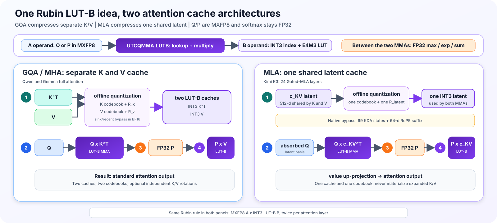

# Vera Rubin 可以把 Attention 加速 30× 吗？Accuracy Simulation 告诉你Truth

## TL;DR

1. **Vera Rubin 提供了什么？** 单卡 HBM4 bandwidth 提高到 22 TB/s；新的 LUT-B Tensor Core 可以用一个 3-bit index 从 8 个 E4M3 数值中取值，并在矩阵乘法内部直接解压，不必先恢复成 BF16。
2. **Attention 怎么用它？** Long-context decode 每生成一个 token 都要重读历史 K/V。我们把 `Kᵀ` 和 `V` 存成 3-bit LUT-B operand，把 Q 和 softmax 后的 P 存成 MXFP8 A operand；Rubin 可以一边读取压缩 KV，一边完成 `Q × Kᵀ` 和 `P × V`。
3. **为什么不能直接把 KV 改成 3-bit？** Naive uniform INT3 会被 outlier 和少数敏感 token 拖垮：Qwen3-4B 的 8K PPL 从 BF16 的 9.468 暴涨到 1504.444。要保住 accuracy，需要 offline per-layer Lloyd-Max codebook；OSCAR rotation/clipping 和 BF16 sink/recent window 可进一步保护敏感值，Q/P 还要按 Rubin 支持的 E4M3 + UE8M0 block32 精度计算。
4. **这样做之后会怎样、理论上能快多少？** Hardware-aligned K3V3 + Q/P simulation 的 8K PPL 为 10.434–10.465，仍接近 BF16；KV 的有效存储降到约 3.63 bit/value。只看 bytes 可以得到 29–32× H100 BF16，但这忽略了 LUT 只能放在 B：MXFP8 MMA 的 M tile 是 128，而 Qwen GQA decode 每个 KV head 只能打包 4 行 Q。加入这个限制后，single-token attention-only ceiling 约为 H100 的 **20.4×**；按 60–80% execution efficiency 则约 **12.3–16.4×**。30× 是 byte-only 上限，不是当前 kernel 的可信预测。

## 1. Intro：Vera Rubin 最近到底变了什么？

### 1.1 从 “faster GPU” 变成 agentic inference platform

NVIDIA 对 Rubin 的官方叙事是 agentic AI：更长 context、更多 reasoning steps、更高 decode interactivity，以及 rack-scale orchestration。单张 Rubin GPU 的公开规格包括 224 SM、896 Tensor Cores、288 GB HBM4 和 22 TB/s HBM bandwidth；Vera Rubin NVL72 则把 72 张 GPU 连接成一个 NVLink 6 scale-up domain。

| Public spec | 1× Rubin GPU | Vera Rubin NVL72 |
|---|---:|---:|
| GPU count | 1 | 72 |
| HBM4 capacity | 288 GB | 20.7 TB |
| HBM bandwidth | 22 TB/s | 1,580 TB/s |
| NVFP4 inference | 50 PFLOP/s | 3,600 PFLOP/s |
| FP8/FP6 published peak | 17.5 PFLOP/s | 1,260 PFLOP/s |
| NVLink bandwidth | 3.6 TB/s | 260 TB/s switch bandwidth |

这些数字来自 [NVIDIA Rubin GPU architecture][nvidia-rubin-gpu] 和 [Vera Rubin NVL72 specs][nvidia-rubin-nvl72]。它们是 peak specs，不等于应用可达到的 sustained performance。

### 1.2 为什么我们特别关心 KV cache？

Community 常用一句话概括 inference：**prefill is compute-bound, decode is bandwidth-bound**。Medium 的 [disaggregated inference 文章][medium-disagg]用这个框架解释了为什么 HBM、KV movement 和 prefill/decode separation 会变得越来越重要。

对长 context decode，每生成一个 token，都需要重新读取历史 K/V。模型越小、context 越长、batch 越高，KV traffic 越可能从配角变成主要瓶颈。因此 Rubin 的 22 TB/s HBM4 很重要；但更有意思的是，它还带来了减少 bytes/value 的新 ISA。

### 1.3 CUDA 13.4 让 Rubin 从 slideware 变成可检查的软件目标

[SemiAnalysis / InferenceX][semianalysis-rubin] 报道了第一版公开 SM107 software stack：CUDA 13.4、PyTorch、vLLM 和 OpenAI Triton 开始加入 Rubin 支持，同时披露了 3-bit programmable LUT Tensor Core。

我们实际安装了 CUDA 13.4.46 Developer Preview，并使用：

- PTX ISA 9.4
- `sm_107a`
- `ptxas`
- `cuobjdump`
- `nvdisasm`

这让我们至少可以做 compile-time legality check。需要注意，vLLM 的 [SM107 tracking issue][vllm-sm107] 仍然是 open，Triton 也只是 [initial Rubin support][triton-sm107]；software bring-up 还没有结束。

## 2. 最相关的新特性：3-bit programmable LUT-B

### 2.1 LUT-B 在做什么？

普通 FP8 B matrix 每个值需要 8 bit。Rubin LUT-B 改为：

1. 每个位置只存一个 3-bit index；
2. index 从 8-entry E4M3 LUT 中选择 reconstruction value；
3. Tensor Core 在 `tcgen05.mma` 内部完成 lookup；
4. kernel 不需要先 materialize 一个 decompressed B matrix。

SemiAnalysis 描述的 granule 是 `K=64 × N=8 = 512` values：

```text
512 × 3-bit index = 192 bytes
8 × E4M3 LUT      =   8 bytes
--------------------------------
total             = 200 bytes
effective         = 3.125 bit/value
```

LUT 不要求 uniform spacing，因此可以放 Lloyd-Max 这种 non-uniform centroids。这也是 3-bit 仍可能保住质量的关键。

### 2.2 CUDA 13.4 compile test 告诉了我们什么？

我们在 clean K8s container 中 compile PTX，并检查生成的 SASS：

| Probe | Compatibility | Compiler / SASS evidence | Meaning |
|---|---:|---|---|
| `sm_107a` target | SUPPORTED | `ptxas` PASS | Rubin compile CI 可建立 |
| UE5M3 conversion | SUPPORTED | `F2FP.SATFINITE.UE5M3` | UE5M3 datatype 本身存在 |
| Dense E4M3 A × LUT-B E4M3 B | SUPPORTED | `UTCQMMA.LUTB` | 基础 QK/PV 映射合法 |
| MXFP8 block32 A × LUT-B B | SUPPORTED | `UTCQMMA.LUTB` + scale TMEM | scaled Q/P 可融合 |
| LUT-B collector B reuse | SUPPORTED | `B_KEEP` → `B_REUSE` | 一个 K/V tile 可跨 GQA heads 复用 |
| Sparse A × ordinary B | SUPPORTED | `UTCQMMA` control | Sparse-A MMA 本身存在 |
| Sparse A × LUT-B B | UNSUPPORTED | `ptxas` rejects `mma.sp...lut::b` | sparse P 不能和 LUT-B V 同时用 |
| MXFP8 + UE5M3 scale + LUT-B | UNSUPPORTED | PTX 9.4 Table 69 | FP8 scale 必须改用 UE8M0 |
| Transposed LUT-B B | UNSUPPORTED | PTX 9.4 restriction | K 必须物理存为 Kᵀ |

PTX 9.4 规定 `mxf8f6f4` 的 block scale 为 UE8M0，而 UE5M3 scale 属于 `mxf4nvf4`。因此 K3V3 attention 的 hardware-valid Q/P contract 是 **E4M3 + UE8M0 block32**。

这些 probes 证明的是 compiler acceptance 和 SASS emission，不是 Rubin runtime correctness。CUDA 13.4 Developer Preview 也明确禁止用 preview performance data 表征硬件。

## 3. 我们做了什么：把 LUT-B 映射到 attention

Rubin LUT-B 有一条最重要的规则：**它只在 MMA 内解压 matrix B**。因此我们不把整个 attention 都压成 3-bit，而是压缩每个 decode step 都会反复读取的 cache；Q 和 P 仍作为 MXFP8 matrix A。

### 3.1 一张图看懂：GQA KV 与 MLA latent



两种架构走的是同一条四步路径：

1. **Cache 只写一次。** 离线准备 codebook；token 进入低精度区域时，只保存 3-bit index 和 8 个 E4M3 lookup values。
2. **第一次 LUT-B MMA。** MXFP8 Q 作为 A，压缩 cache 作为 B，计算 attention scores。
3. **Softmax 保持 FP32。** max、exp、sum 和 normalization 不降到 INT3；得到的 P 留在片上，再转成 MXFP8。
4. **第二次 LUT-B MMA。** MXFP8 P 作为 A，同一类压缩 cache 作为 B，得到 attention output。

差别只在“压缩哪一份 cache”：

- **GQA / MHA（Qwen、Gemma）**缓存独立的 `K^T` 和 `V`，所以每层有 K/V 两套 codebook，也可以有独立的 `R_k` / `R_v`。sink 64、recent 256 和未满 block 保持 BF16。
- **MLA（Kimi K3）**不展开 K/V，只缓存一份共享的 512-d latent `c_KV`，所以每层只需一套 codebook 和一个 latent rotation。Kimi 的 69 个 KDA states 与 64-d RoPE suffix 保持原生精度；只有 24 个 Gated-MLA layers 的 latent 进入 K3V3。

### 3.2 Attention 里具体怎么算？

| 架构 | 第一次乘法：算 scores | 中间 | 第二次乘法：算 output |
|---|---|---|---|
| GQA / MHA | MXFP8 `Q` × LUT-B `K^T` | FP32 softmax 得到 `P` | MXFP8 `P` × LUT-B `V` |
| MLA | MXFP8 absorbed `Q` × LUT-B `c_KV^T`，再加原生 RoPE 部分 | FP32 softmax 得到 `P` | MXFP8 `P` × LUT-B `c_KV`，再做 value up-projection |

这里最重要的是：INT3 cache 不需要先解压回 HBM。Tensor Core 在 `UTCQMMA.LUTB` 内一边 lookup、一边做乘法。Q/P 使用 E4M3 element + UE8M0 block32 scale；Qwen3-4B 的 GQA 还可以通过 `B_KEEP -> B_REUSE`，让一个 K/V tile 服务 4 个 Q heads。

### 3.3 Lloyd-Max：把 8 个刻度放到真正需要的位置

3-bit 只能表示 8 个值。最简单的 uniform quantization 会把 8 个刻度等距排开；如果大多数值挤在 0 附近、只有少量 outlier 很大，很多刻度会浪费在几乎没有数据的区域，0 附近反而分得太粗。

Lloyd-Max 的做法很直接：

1. 在 calibration data 上先放 8 个初始中心。
2. 每个数分给离它最近的中心。
3. 把每组中心移动到这一组数据的平均值。
4. 重复第 2、3 步直到基本不再变化，最后只做一次 E4M3 rounding。

这个过程完全离线进行。Serving 时不再迭代，只需找到最近的一个中心并保存其 3-bit index。GQA 每层分别拟合 K/V 两套 8-value codebook；MLA 每层只拟合 latent 的一套 codebook。

### 3.4 OSCAR：先把尖峰摊平，再交给 3-bit

Lloyd-Max 解决的是“8 个刻度放在哪里”，但如果少数维度特别大，3-bit 仍然很难表示。OSCAR 可以理解为：**先旋转坐标系，把集中在少数维度的尖峰摊到更多维度，再量化。**

具体只有三步：

1. 在 calibration data 上为每层学习一个 orthogonal rotation。
2. 写 cache 前先 rotation，并裁掉极少数最极端的 outliers，然后用 Lloyd-Max K3V3。
3. 在 QK/PV 的另一侧做对应变换或 inverse rotation，让原来的 attention 数学关系保持不变。

GQA 可以分别使用 `R_k` 和 `R_v`；MLA 因为 K/V 共享同一个 `c_KV`，只能使用一个 latent rotation，并把对应变换吸收到 absorbed-query 和 value projection。最简单的记法是：**Lloyd-Max 调整尺子的 8 个刻度，OSCAR 先把要量的东西铺平。**

H100 实验模拟了上述 numerical QDQ、BF16 safety window 和 FP32 softmax，但 physical cache 仍是 BF16。一个由 1 个 KDA layer + 1 个 Gated-MLA layer 组成的 dummy-weight integration smoke 已完成 health check 和真实 generation，验证了 latent K3V3 与 Q/P kernel 的连接；它不代替完整 2.8T checkpoint 的分布式加载验证。真实 Rubin 实现还需要 3-bit paged allocation、descriptor/swizzle、TMEM copy、barrier 和 fused SM107 kernel。

## 4. 我们 measure 了什么？

### 4.1 Accuracy setup

| Item | Setting |
|---|---|
| Primary ablation model | Qwen3-4B-Thinking-2507 |
| PPL | WikiText-2 test，16 × 8192-token blocks |
| KL | BF16→quantized top-50 bucketed forward KL |
| Cross-model accuracy | GPQA Diamond full set，3 seeds |
| High-precision window | sink 64 + recent 256 |
| K/V | offline per-layer Lloyd-Max E4M3 LUT |
| Q/P | E4M3 element + UE8M0 block32 scale |

`KL₅₀` 在 16 个 WikiText blocks 各取 16 个固定位置，共 256 samples。BF16 top-50 token 各自成桶，其余 vocabulary 合并成 tail bucket；因此它是 full-vocabulary KL 的 data-processing lower bound，单位 nats/token。

### 4.2 Accuracy analysis

本节只比较 PPL 和 KL₅₀。PPL 衡量 sequence likelihood，KL₅₀ 则直接衡量 quantized logits 相对 BF16 teacher 的分布偏移。

#### 4.2.1 Sink/recent ablation

固定 Qwen3-4B-Thinking-2507，并保持 Q/P 为 BF16，只改变高精度窗口。A 组使用 OSCAR + offline LM K3V3；B 组使用 ordinary uniform K3V3，不使用 OSCAR 或 Lloyd-Max。每组都扫描 `64/256`、`0/256`、`64/0`、`0/0`，并使用相同的 8K WikiText-2 blocks。

**A. OSCAR + offline LM K3V3**

| BF16 Sink | BF16 Recent | PPL↓ | KL₅₀↓ |
|---:|---:|---:|---:|
| 64 | 256 | 10.453 | 0.09482 |
| 0 | 256 | 15.019 | 0.36044 |
| 64 | 0 | 10.659 | 0.14341 |
| 0 | 0 | 16.260 | 0.44066 |

**B. Ordinary K3V3（uniform LUT，无 OSCAR、无 Lloyd-Max）**

| BF16 Sink | BF16 Recent | PPL↓ | KL₅₀↓ |
|---:|---:|---:|---:|
| 64 | 256 | 1504.444 | 5.14717 |
| 0 | 256 | 1875.596 | 5.40732 |
| 64 | 0 | 1890.707 | 5.42792 |
| 0 | 0 | 2489.291 | 5.59230 |

OSCAR + offline LM 下，保留 sink 64、去掉 recent 的影响相对有限；去掉 sink 则 PPL/KL 明显恶化。ordinary uniform K3V3 在四种窗口下都已经崩溃，说明 window 无法补偿缺少 rotation 和 non-uniform codebook 的量化误差。

#### 4.2.2 Overall measurement

| Method | BF16 Sink | BF16 Recent | PPL↓ | KL₅₀↓ |
|---|---:|---:|---:|---:|
| BF16 | all | all | **9.468** | **0.0000** |
| OSCAR INT2、无 LM | 64 | 256 | 9.893 | 0.10791 |
| Offline LM K3V3、无 OSCAR | 64 | 256 | **10.406** | 0.09618 |
| Offline LM K3V3、无 OSCAR + FP8/UE8M0 Q/P | 64 | 256 | 10.434 | 0.10447 |
| OSCAR + offline LM K3V3 + FP8/UE8M0 P only | 64 | 256 | 10.446 | 0.09609 |
| OSCAR + offline LM K3V3 | 64 | 256 | 10.453 | **0.09482** |
| OSCAR + offline LM K3V3 + FP8/UE8M0 Q/P | 64 | 256 | 10.465 | 0.10090 |
| OSCAR + offline LM K3V3 + FP8/UE8M0 Q only | 64 | 256 | 10.466 | 0.09935 |
| Ordinary uniform K3V3 | 64 | 256 | 1504.444 | 5.14717 |

8K 下，no-OSCAR offline LM 的 PPL 最低（10.406），而 OSCAR + offline LM 的 KL₅₀ 最低（0.09482）；两者分别优化不同目标。加入 Q/P QDQ 会小幅增加 PPL 与 KL。OSCAR INT2 的 PPL 更低，但 KL₅₀ 高于两种未加 Q/P 的 K3V3。

#### 4.2.3 Cross-model measurement

PPL/KL 使用 8K protocol；accuracy 使用 GPQA Diamond 三种子。Qwen3.5 是 hybrid Gated DeltaNet 模型，因此 K3V3 只覆盖 10 个 full-attention layers；Gemma4 的 40 个 sliding-attention layers 使用 256-d head，8 个 full-attention layers 使用 512-d head，两种 geometry 分别拟合 rotation 和 per-layer codebook。Gemma4 的 PPL/KL 使用 base checkpoint，GPQA 使用 instruction-tuned checkpoint。Kimi K3 只量化 24 个 Gated-MLA layers 的 512-d latent，69 个 KDA states 与 64-d RoPE suffix 保持原生精度；其 native mode 只作为 KL₅₀ teacher。Kimi PPL 沿用 native Kimi protocol：每个 8192-token block 只计最后 2048 个 token 的 NLL，context 仍为完整 8K；不同模型的绝对 PPL 不应横向比较。

| Model | Method | PPL↓ | KL₅₀↓ | GPQA↑ |
|---|---|---:|---:|---:|
| Qwen3.5-35B-A3B | OSCAR + offline LM K3V3 + FP8/UE8M0 Q/P | 6.127 | **0.02295** | 82.49% |
| Qwen3.5-35B-A3B | Offline LM K3V3 + FP8/UE8M0 Q/P（无 OSCAR） | **6.109** | 0.02870 | **82.83%** |
| Gemma4-12B | OSCAR + offline LM K3V3 + FP8/UE8M0 Q/P | 6.120 | **0.04806** | 62.29% |
| Gemma4-12B | Offline LM K3V3 + FP8/UE8M0 Q/P（无 OSCAR） | 6.388 | 0.07572 | 62.29% |
| Kimi K3 | OSCAR + offline LM K3V3 + FP8/UE8M0 Q/P | **1.564** | **0.00679** | — |
| Kimi K3 | Offline LM K3V3 + FP8/UE8M0 Q/P（无 OSCAR） | 1.601 | 0.00800 | — |

Kimi K3 的公开 checkpoint 是 2.8T-parameter、1.56 TB MXFP4 model。两行结果都基于 MLA latent K3V3，不把 512-d latent 展开成标准 K/V 后再量化；native checkpoint 仅提供 KL teacher distribution，不作为第三条结果。Latent OSCAR 把 PPL 从 1.601 降到 1.564（约 2.3%），并把 KL₅₀ 从 0.00800 降到 0.00679（约 15.2%）；GPQA 三种子仍需完成后再填。

### 4.3 Throughput：Rubin 上理论能到哪里？

先看单 GPU hardware。H100 和 B200 可以作为 bandwidth baseline，但它们没有 SM107 的 `decompress::lut::b`；只有 Rubin 能原生执行本文的 K3V3 LUT-B path。

| GPU | Memory | Capacity | HBM bandwidth | Dense FP8 ceiling | Native LUT-B |
|---|---|---:|---:|---:|---:|
| H100 SXM | HBM3 | 80 GB | 3.35 TB/s | 1.979 PFLOP/s | No |
| B200 SXM | HBM3e | 180 GB | up to 8 TB/s | 4.5 PFLOP/s | No |
| Rubin | HBM4 | 288 GB | 22 TB/s | 8.75 PFLOP/s assumption | **Yes** |

H100 数据来自 [NVIDIA H100 specs][nvidia-h100]；B200 使用 [NVIDIA HGX component specs][nvidia-hgx] 的 180 GB / up to 8 TB/s，以及公开 4.5 PFLOP/s dense FP8；Rubin 的 8.75 PFLOP/s 是将 17.5 PFLOP/s published sparse peak 折半后的 modeling assumption。这个 peak 只有在 MMA tile 被填满时才成立；single-token decode 不能直接把它当成 compute ceiling。

Qwen3-4B-Thinking-2507 有 36 layers、32 Q heads、8 KV heads、head dim 128。每个 decode token 的 attention logical FLOPs 为 `4 × Q_heads × head_dim × context × layers`。

#### 4.3.1 如果三张卡都读取 BF16 KV

BF16 KV 下 arithmetic intensity 只有 4 FLOP/B，因此三张卡都明显 HBM-bound。

| GPU | 8K BF16 roofline | 8K attention-only tok/s | 32K BF16 roofline | 32K attention-only tok/s |
|---|---:|---:|---:|---:|
| H100 SXM | 13.4 TFLOP/s | 2.77K | 13.4 TFLOP/s | 0.69K |
| B200 SXM | 32.0 TFLOP/s | 6.62K | 32.0 TFLOP/s | 1.66K |
| Rubin | 88.0 TFLOP/s | 18.21K | 88.0 TFLOP/s | 4.55K |

这里 TFLOP/s 随 context 不变，是因为 BF16 arithmetic intensity 固定；token/s 会随 context 变长而下降。

#### 4.3.2 如果只按 K3V3 compressed bytes 计算

K3V3 加上 BF16 sink/recent 后，8K 的 effective storage 是 3.628 bit/value，32K 是 3.251 bit/value；对应 arithmetic intensity 为 17.64 / 19.69 FLOP/B。

| GPU | 8K compressed-byte roofline | 8K tok/s | 32K compressed-byte roofline | 32K tok/s | 能否原生执行 |
|---|---:|---:|---:|---:|---|
| H100 SXM | 59.1 TFLOP/s | 12.23K | 66.0 TFLOP/s | 3.41K | No：需要 software unpack |
| B200 SXM | 141.1 TFLOP/s | 29.21K | 157.5 TFLOP/s | 8.15K | No：没有 LUT-B |
| Rubin | **388.1 TFLOP/s** | **80.32K** | **433.1 TFLOP/s** | **22.41K** | **Yes：`UTCQMMA.LUTB`** |

H100/B200 两行只是 “如果 HBM 只搬这些 compressed bytes” 的 normalization ceiling，不是可执行的 native K3V3 performance。它们必须先用 software unpack/dequantize，实际会增加 instructions、temporary traffic 和 latency。Rubin 的区别是 lookup 发生在 Tensor Core MMA 内。

#### 4.3.3 LUT 只能放 B：对 single-token decode 的影响

这里需要加入一个此前 byte roofline 漏掉的限制。把 decode 写成 `K × Q^T` / `V^T × P^T` 时，长 KV 位于 A 的 M 方向，短 Q/P 位于 B 的 N 方向；对非常 skinny 的 GEMV，这个方向更容易填满不对称的 MMA tile。但是 LUT 解压只支持 B，所以 compressed KV 必须使用 `Q × K^T` / `P × V` 的方向。

Donglin 对用户指出的这条 kernel 是对的。[FlashInfer SM100 GQA decode][flashinfer-mma] 明确设置 `mma_tile_m=128`；GEMM1 的 A 是 K、B 是 Q，GEMM2 的 A 是 V、B 是 P。它让 sequence/head-dim 填满 A 的 M 方向，并把 GQA heads × prediction tokens 填进 B 的 N 方向。需要同时区分其他实现：FlashInfer 旧的 prefill/Tensor Core path 与 FlashAttention-3 也存在 Q/P-as-A、KV-as-B 的排布。因此 operand 角色不是 GQA 的数学规定，而是 kernel-specific schedule；被指出的最新 CuTe decode kernel 确实选择了 KV-as-A。

PTX 的 `kind::mxf8f6f4` shape 是 `M=128`、`N` 从 8 起。Qwen3-4B 的 GQA ratio 是 4，所以一个共享 K/V tile 最多把 4 个 Q heads 打包成 4 行：

| 方向 | 有效 tile occupancy | Tile-adjusted compute cap | 8K roofline | 32K roofline |
|---|---:|---:|---:|---:|
| 只按 compressed bytes，不看 shape | — | 8.75 PFLOP/s | 388.1 TFLOP/s | 433.1 TFLOP/s |
| **LUT-B：Q/P 在 A，KV 在 B** | M：4 / 128 = **3.125%** | **273.4 TFLOP/s** | **273.4 TFLOP/s** | **273.4 TFLOP/s** |
| FlashInfer dense-FP8 decode：KV 在 A，Q/P 在 B | N：4 / 16 = 25% | 2.1875 PFLOP/s | 388.1 TFLOP/s | 433.1 TFLOP/s |
| 假想 Rubin compressed-A（N 最小 8） | N：4 / 8 = 50% | 4.375 PFLOP/s | 388.1 TFLOP/s | 433.1 TFLOP/s |

为了检查“交换 operand 本身是否总会更快”，我们还在 B300 上用普通 padded dense-E4M3 GEMM 测了相同 logical work。Q/P-as-A 与 KV-as-A 的 median latency 分别为：QK 8K `39.97 / 40.42 µs`、PV 8K `43.71 / 46.70 µs`、QK 32K `52.42 / 53.41 µs`、PV 32K `57.95 / 57.18 µs`。差异在约 7% 以内。这个 cuBLASLt microbench 不包含 FlashInfer 的 persistent decode schedule、TMEM softmax pipeline 或 LUT-B，因此它只能说明“operand 名字本身”不会自动产生巨大 penalty，不能推翻 FlashInfer 对 M/N tile 的选择，也不能替代 Rubin measurement。

所以对 Qwen GQA4 single-token decode，B-only constraint 把 byte-only ceiling 再除以约 **1.42× @ 8K / 1.58× @ 32K**。MHA/GQA ratio 1 受影响更大；GQA ratio 8、同一 KV 上的 multi-token decode，或者 speculative decode `T≥2` 则能填入更多 A rows，可能重新回到 bandwidth-bound。

另一个可测试的折中是 dense E4M3 A：`kind::f8f6f4` 支持 `M=64`，Qwen GQA4 的 tile-adjusted cap 会升到约 546.9 TFLOP/s，足以覆盖当前 HBM roofline；代价是失去原生 UE8M0 block32 scaling，需要软件缩放并重新做 accuracy validation。本文目前的质量数字对应 MXFP8/UE8M0，因此不能直接认领这个更高 ceiling。如果 SM107 最终存在尚未公开的 LUT-B small-M special path，这个 cap 会改变；当前 public PTX 与 compile probes 不能假设它存在。

#### 4.3.4 Operand-corrected practical range

| Context | Effective KV bits/value | Byte-only HBM roofline | B-only tile-corrected ceiling | Expected @ 60–80% | Corrected tok/s | vs Rubin BF16 |
|---:|---:|---:|---:|---:|---:|---:|
| 8K | 3.628 | 388.1 TFLOP/s | **273.4 TFLOP/s** | **164.1–218.8 TFLOP/s** | 56.59K | 3.11× |
| 32K | 3.251 | 433.1 TFLOP/s | **273.4 TFLOP/s** | **164.1–218.8 TFLOP/s** | 14.15K | 3.11× |

加入 operand shape 后，single-token attention-only ceiling 相对 H100 BF16 约为 **20.4×**，相对 B200 BF16 约为 **8.5×**；若再按 tile-corrected ceiling 的 60–80% 估计，则分别约为 **12.3–16.4×** 和 **5.1–6.8×**。标题中的 30× 只在 byte-only roofline、或能用 GQA/multi-token/small-M path 重新填满 Tensor Core 时成立。

如果完全失去 GQA B-tile reuse，8K/32K bandwidth ceiling 会降到约 97.0 / 108.3 TFLOP/s，此时又会变回 HBM-bound。所有 token/s 都是 attention-only ceiling，不包含 model weights、MLP、sampling、scheduler、communication 和 power throttling；它们不等于 Qwen3-4B end-to-end output token/s，也不是 Rubin 实机成绩。

## 5. 这个故事目前说明了什么？

1. **Dense KV-on-LUT-B 没有 legality blocker，但有 decode-shape blocker。** PTX 不要求 B 必须是 static weight；`Kᵀ` 和 `V` 可以成为动态 compressed B，但 B-only + MXFP8 M=128 会限制 single-token tile occupancy。
2. **Compile proof 不等于 kernel done。** 我们生成了 `UTCQMMA.LUTB` SASS，但还没有 production PagedAttention implementation。
3. **Precision contract 必须由 ISA 决定。** 对 LUT-B 的 MXFP8 A operand，hardware contract 是 E4M3 + UE8M0 block32。
4. **Offline LM 是更真实的 serving recipe。** 它移除了 runtime centroid fitting，只保留 index assignment。
5. **Performance 不只看 bytes。** Packed layout、HBM efficiency 和 collector reuse 仍然重要，但 GQA packing、multi-token decode 与 small-M path 决定 Tensor Core 能否吃到这些 bandwidth 收益。

## Reproducibility

- Offline codebooks：`/shared/oscar-int3-rubin-simulate/codebooks/qwen3-4b-thinking-2507/offline-wikitext-v2/`
- PPL / KL：`/shared/oscar-int3-rubin-simulate/offline-v2/`
- CUDA 13.4 compile artifacts：`/shared/oscar-int3-rubin-simulate/analysis/rubin-isa-cuda13.4-clean/`
- Roofline calculator：`rotation/rubin_k3v3_roofline.py --compare-hardware`
- Compile probes：`rotation/rubin_compile_probes/run_compile_probes.py`

## References

- [NVIDIA: Inside NVIDIA Rubin GPU Architecture][nvidia-rubin-gpu]
- [NVIDIA: Inside the Vera Rubin Platform][nvidia-rubin-platform]
- [NVIDIA: Vera Rubin NVL72 specs][nvidia-rubin-nvl72]
- [NVIDIA: H100 product specifications][nvidia-h100]
- [NVIDIA: HGX H100/B200/B300 components][nvidia-hgx]
- [SemiAnalysis / InferenceX: Vera Rubin NVL72 vs GB200 NVL72][semianalysis-rubin]
- [Medium: Prefill is Compute, Decode is Bandwidth][medium-disagg]
- [CUDA 13.4 Developer Preview release notes][cuda134-release]
- [PTX ISA 9.4][ptx94]
- [FlashAttention-3][flashattention3]
- [FlashInfer Tensor Core attention source][flashinfer-mma]
- [OpenAI Triton initial SM107 support][triton-sm107]
- [vLLM SM107 tracking issue][vllm-sm107]

[nvidia-rubin-gpu]: https://developer.nvidia.com/blog/inside-nvidia-rubin-gpu-architecture-powering-the-era-of-agentic-ai/
[nvidia-rubin-platform]: https://developer.nvidia.com/blog/inside-the-nvidia-rubin-platform-six-new-chips-one-ai-supercomputer/
[nvidia-rubin-nvl72]: https://www.nvidia.com/en-us/data-center/vera-rubin-nvl72/
[nvidia-h100]: https://www.nvidia.com/en-us/data-center/h100/
[nvidia-hgx]: https://docs.nvidia.com/enterprise-reference-architectures/hgx-ai-factory/latest/components.html
[semianalysis-rubin]: https://inferencex.semianalysis.com/blog/vera-rubin-nvl72-vs-gb200-nvl72-inference
[medium-disagg]: https://medium.com/@asheesh.goja/prefill-is-compute-decode-is-bandwidth-the-architectural-case-for-disaggregated-llm-inference-92c8b36d1a88
[cuda134-release]: https://docs.nvidia.com/cuda/developer-preview/13.4/cuda-toolkit-release-notes/index.html
[ptx94]: https://docs.nvidia.com/cuda/developer-preview/13.4/parallel-thread-execution/index.html
[flashattention3]: https://tridao.me/publications/flash3/flash3.pdf
[flashinfer-mma]: https://github.com/flashinfer-ai/flashinfer/blob/b1d95851675b8799d623df4d5a7d6eac3254b3ff/flashinfer/cute_dsl/attention/gqa_decode_paged.py#L222-L259
[triton-sm107]: https://github.com/triton-lang/triton/commit/ab592f012f37f2c2ffc9ceda6c5b49b3c37c9036
[vllm-sm107]: https://github.com/vllm-project/vllm/issues/49735
