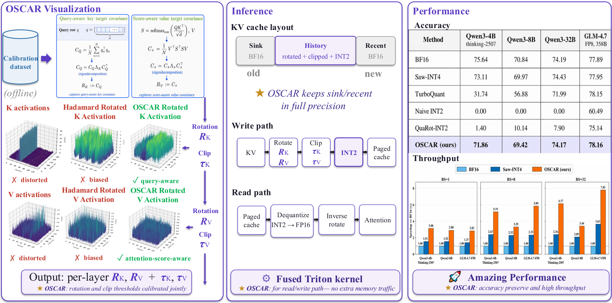
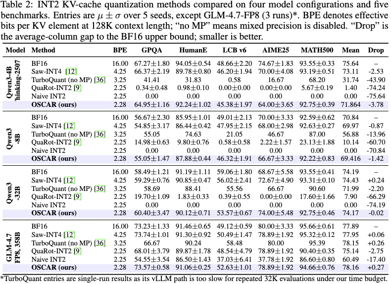

<p align="center">
  
</p>

# OSCAR

### Offline Spectral Covariance-Aware Rotation for 2-bit KV Cache Quantization

<p align="center">
  <a href="https://arxiv.org/pdf/2605.17757"></a>
  <a href="https://oscar-quantize.github.io/"></a>
  <a href="https://huggingface.co/Zhongzhu/OSCAR-RotationZoo"></a>
  <br/>
  <a href="https://huggingface.co/Zhongzhu/OSCAR-LLAMACPP-Qwen3-32B-INT2-KV"></a>
  <a href="https://huggingface.co/Zhongzhu/OSCAR-LLAMACPP-Gemma-4-12B-it-INT2-KV"></a>
  <a href="https://huggingface.co/Zhongzhu/OSCAR-LLAMACPP-Qwen3-4B-Thinking-2507-INT2-KV"></a>
</p>

OSCAR captures Q/K/V activations on a small calibration set, estimates **attention-aware K/V covariance structures** offline, and derives per-layer rotations + clipping thresholds that align KV quantization with the directions attention actually consumes. By storing the bulk of the KV cache in INT2 while retaining only a small BF16 sink and recent window, OSCAR reduces KV-cache memory by approximately **8×** compared with BF16. Under the same memory budget, our **attention kernel** enables up to **7× higher throughput** at large batch sizes, and also accelerates batch-size-1 decoding by up to **3×** by reducing memory-bandwidth overhead.


<p align="center">
  
</p>

OSCAR is built directly into the open-source SGLang framework (main branch), llama.cpp (zhongzhu/llamacpp branch). We also provide a rotation zoo so users can download calibrated rotations directly instead of recomputing them.

## 🔥 Latest News
- **[Upcoming]** OSCAR is testing MiniMax 3, GLM 5.2 and more models in long horizon agentic tasks (1M+ token context). Happy to see OSCAR used in the wild!
- **[2026-06-26]** OSCAR is PRing into **vLLM** too, bringing INT2 KV cache support to another high-throughput serving stack.
- **[2026-06-07]** OSCAR INT2 KV cache now runs **256K Gemma 4 12B under <code style="color : Red">!!16GB!!</code>** and **Qwen3** on the [`zhongzhu/llamacpp` llama.cpp fork](https://github.com/FutureMLS-Lab/OSCAR/tree/zhongzhu/llamacpp) — **~8× smaller KV at near-f16 quality**, with [pre-built `*-rot-kv.gguf` on Hugging Face](https://huggingface.co/Zhongzhu/OSCAR-LLAMACPP-Gemma-4-12B-it-INT2-KV). RUN GEMMA 4 / QWEN3 with LONG CONTEXT on your LOCAL MAC!
  <details>
  <summary> <b>MacBook M5 Max Gemma 4 12B OSCAR INT2 KV Local Run Video</b></summary>
  
  </details>
- **[2026-06-05]** OSCAR now runs its INT2 KV cache through a fused mixed-precision Flash-Attention kernel on Apple Metal in the [`zhongzhu/llamacpp` llama.cpp fork](https://github.com/FutureMLS-Lab/OSCAR/tree/zhongzhu/llamacpp), making long-context decode up to ~15× faster (near-BF16) at ~7× less KV memory. Try to RUN QWEN-3-32B with LONG CONTEXT in your LOCAL MAC!
  <details>
  <summary><b>MacBook M5 Max Qwen3-32B OSCAR INT2 KV Local Run Screenshot</b></summary>
  
  </details>
- **[2026-06-04]** OSCAR now supports **Gemma 4 12B** with **SGLang INT2 KV cache** on the [`zhongzhu/gemma4-12b`](https://github.com/FutureMLS-Lab/OSCAR/tree/zhongzhu/gemma4-12b) branch.
- **[2026-05-31]** OSCAR is now runnable on the zhongzhu/llamacpp branch of **llama.cpp**. Feedback and suggestions are very welcome!
- **[2026-05-23]** OSCAR release the [qwen3.5 4B, 35B-A3B, minimax-m2.7 229B preview results](#main-results). You can use OSCAR for qwen3.5, minimax2.7 beta now! refer to branch zhongzhu/hybrid-model and set SGLANG_LLOYD_MAX=1.
- **[2026-05-18]** Full release: [paper](https://arxiv.org/pdf/2605.17757), code, [website](https://oscar-quantize.github.io/), and [RotationZoo](https://huggingface.co/Zhongzhu/OSCAR-RotationZoo) are all live — runs out of the box on **SGLang**.

## 📖 Table of Contents
- [Main results](#main-results)
- [Layout](#layout)
- [Setup](#setup)
- [Quick start (Qwen3-8B example)](#quick-start-qwen3-8b-example)
- [Model support](#model-support)
- [All configured models](#all-configured-models)
- [How the rotation is fit (spectral covariance)](#how-the-rotation-is-fit-spectral-covariance)
- [Serving with the rotation](#serving-with-the-rotation)
- [Calibration knobs](#calibration-knobs)
- [Troubleshooting](#troubleshooting)
- [Citation](#citation)
- [License & acknowledgements](#license--acknowledgements)

## Main results
<details>
<summary><b>Qwen3.5-4B, Qwen3.5-35B-A3B, MiniMax 2.7 Preview</b> </summary>

Qwen3.5 — BF16 vs OSCAR INT2 KV (2-bit, sink 64 / recent 256), mean ± std over 3 seeds (35B-A3B AIME: 8 seeds, N=30 is high-variance). OSCAR quantizer per model best: 4B uniform, 35B-A3B Lloyd-Max.

**Qwen3.5-4B**
| Benchmark | BF16 | OSCAR | Δ vs BF16 |
|---|:---:|:---:|:---:|
| GPQA-Diamond | 76.9 ± 1.3 | **75.8 ± 1.6** | −1.2 |
| HumanEval | 81.7 ± 1.8 | **83.9 ± 1.0** | +2.2 |
| AIME 2025 | 47.8 ± 3.1 | **46.7 ± 0.0** | −1.1 |
| MATH500 | 89.5 ± 0.6 | **88.0 ± 0.6** | −1.5 |

**Qwen3.5-35B-A3B**
| Benchmark | BF16 | OSCAR | Δ vs BF16 |
|---|:---:|:---:|:---:|
| GPQA-Diamond | 83.3 ± 1.8 | **84.0 ± 1.3** | +0.7 |
| HumanEval | 83.9 ± 0.6 | **86.6 ± 1.8** | +2.6 |
| AIME 2025 † | 66.7 ± 5.3 | **62.1 ± 4.7** | −4.6 |
| MATH500 | 92.8 ± 0.2 | **91.7 ± 0.4** | −1.1 |

<sub>† AIME N=30 is high-variance; measured over 8 seeds. The −4.6 gap is not statistically significant (Welch t=1.72). At 3 seeds it read −6.7, inflated by a favorable BF16 draw.</sub>

MiniMax2.7
| Benchmark | BF16 | OSCAR (LM_RATIO=1.16) | Δ |
|---|---|---|---|
| GPQA-Diamond | 0.7828 | **0.7929** | +1.0 pp |
| HumanEval | 0.8817 | **0.8854** | +0.4 pp |
| AIME 2025 | 0.7667 | **0.7667** | 0.0 pp |
| MATH500 | 0.9379 | **0.9279** | −1.0 pp |

</details>

<details>
<summary><b>MLA models — packed 2-bit latent (GLM-5.2, GLM-5.3, Kimi-K3)</b> </summary>

**What is quantized.** MLA stores one shared latent `c_kv` plus a positional
`k_pe`. OSCAR quantizes **the latent** and leaves **`k_pe` in BF16** — the
opposite way round from how it is easy to read. Per token per layer, at
`kv_lora_rank=512`, `qk_rope_head_dim=64`, group 128:

| buffer | bytes | contents |
|---|---:|---|
| `c_codes` | 128 | the 512-dim latent at **2 bits**, 4 per byte |
| `c_params` | 32 | (scale, zero) fp32 per quantization group |
| `rope_buf` | 128 | `k_pe`, **BF16, never quantized** |
| **total** | **288** | vs BF16's `(512+64)·2 = 1152` → **4.00×** |

`k_pe` staying BF16 is load-bearing: it is the positional half of the MLA key
and 2-bit'ing it destroys the rope term. It is also **44% of the cell**, which
caps this axis — a latent compressed to zero bits would still leave 256 B, i.e.
**4.5× is the ceiling**, and the shipped 4.00× already sits just under it.

**GPQA-Diamond, full 198 questions, `max_tokens=32768`, single seed.** Same
question set and permutations across arms (`Random(0)`), so the rows are paired.

| Model | BF16 | packed 2-bit (4.00×) | Δ |
|---|---:|---:|---:|
| GLM-5.2 | 82.32 | 74.75 | −7.57 pp |
| GLM-5.3 | 82.83 | **77.78** | **−5.05 pp** |

At a **64K** generation budget both models are measured on the same 48-question
subset (`n=48`, `max_tokens=65536`). Kept as its own table because neither the
question count nor the budget matches the one above, and the two are not
comparable — but the rows here are comparable to each other:

| Model | budget | n | BF16 | packed 2-bit (4.00×) | Δ |
|---|---|---:|---:|---:|---:|
| GLM-5.2 | 64K | 48 | 87.50 | 83.33 | −4.17 pp |
| **Kimi-K3** | 64K | 48 | **93.75** | **83.33** | **−10.42 pp** |

The two land on the same 83.33 from very different starting points: K3's BF16 is
6.25 pp higher, and 2 bits takes all of that back and more. Whatever is costing
K3 its 10 points is specific to K3, not to the packed path — GLM-5.2 runs the
identical quantiser for less than half the loss.

GLM-5.3 required **zero model-code changes** — `GlmMoeDsaForCausalLM` is
identical to GLM-5.2's — but rotations do **not** transfer between models and
must be refitted from each model's own `c_kv` dump.

**Ratio / accuracy frontier (GLM-5.2, all end-to-end at n=198).** Every knob
inside 2 bits has been measured; none closes the 4.00× gap, and bit width buys
more accuracy per unit of ratio surrendered than group size does:

| config | ratio | GPQA | vs BF16 |
|---|---:|---:|---:|
| 2-bit g128 (shipped) | 4.00× | 74.75 | −7.57 |
| 2-bit g32 | 3.00× | 77.78 | −4.54 |
| 4-bit g128 | 2.77× | 80.81 | −1.51 |
| BF16 | — | 82.32 | — |

**Where K3's loss actually sits.** Adding stock upstream to the same 48
questions separates the quantiser from this fork:

| arm | KV | GPQA |
|---|---|---:|
| stock upstream sglang | BF16 | 95.83 |
| this fork, no quantiser | BF16 | **93.75** |
| this fork, packed 2-bit | 4.00× | **83.33** |

So the serving path costs **2.1 pp** — one question out of 48, inside the noise
of a single 48-question run — and 2-bit costs **10.4 pp**. Reaching 90 is a
bit-width question, not a bug hunt.

K3 pays more for 2 bits than the GLM models do (−4.2 pp for GLM-5.2 at the same
n=48/64K, −5.1 pp for GLM-5.3 at n=198/32K). It is a KDA/MLA hybrid where only
24 layers carry a latent rotation, so the quantisation error concentrates in
far fewer layers instead of being spread across all of them.

Both figures are single runs at n=48; the standard error on each is about
±5 pp, so the 10.4 pp separation is real but its decimals are not.

That gap prompted an attempt to replace K3's model file with upstream's
wholesale. The attempt is recorded here because it failed instructively: the
ported file served but produced word salad, and the next 38 commits went to
repairing its fallout. Two of those repairs were genuine defects in shared
code and were kept — a use-after-free on the KDA decode metadata, and a
`gate_up_interleaved` that was threaded through FusedMoE and never read.
Neither was K3's problem. K3's problem was the replacement. The model line is
back on the file that scored 70.83.

Worth knowing before trying again: K3's chat format is Python
(`encoding_k3.py`), not a jinja template, and its expert weights are
compressed-tensors `mxfp4-pack-quantized` with only the routed experts
quantized. Its `--reasoning-parser kimi_k3` does not exist in this fork, so
thinking is not split out of `content` and any length comparison against
upstream is not like-for-like.

</details>

<details>
<summary><b>Multi-Modal & LongBench</b> </summary>
Use Rotation and Run Script in zhongzhu/VL branch. Baseline numbers taken from arxiv.org/abs/2605.19660 (Su et al., 2026).

OCRBench comparison
| Method                          | Qwen3-VL-8B | Qwen3-VL-4B |
|---------------------------------|------------:|------------:|
| 16-bit Baseline                 | 858         | 852         |
| QuaRot (INT2)                   | 722         | 773         |
| RotateKV (INT2)                 | 754         | 638         |
| KIVI (INT2)                     | 851         | 813         |
| OTT (INT2)                      | 850         | 831         |
| TurboQuant+ (2.5-bit)           | 847         | 828         |
| **OSCAR (Lloyd-Max)**           | **854**     | **848**     |

Omni-Modal LLMs: MMAU-Pro

| Method (Qwen3-Omni-30B-A3B) | Open-ended | Good Rate | AIF |
|:---------------------------|:----------:|:---------:|:---:|
| 16-bit Baseline | 66.2 | 27.8 | 87.4 |
| KIVI (INT2) | 65.8 | 27.0 | 78.2 |
| OTT (INT2) | 65.8 | 26.9 | 83.9 |
| TurboQuant+ (2.5-bit) | 66.6 | 27.0 | 79.3 |
| **OSCAR** | **67.4** | **33.8** | **89.7** |

LongBench-E comparison

| Method                          | Qwen3-8B    |
|---------------------------------|------------:|
| 16-bit Baseline                 | 49.56       |
| QuaRot (INT2)                   | 40.13       |
| RotateKV (INT2)                 | 42.95       |
| KIVI (INT2)                     | 47.95       |
| OTT (INT2)                      | 48.21       |
| TurboQuant+ (2.5-bit)           | 47.56       |
| **OSCAR**                       | **50.25**   |
</details>

**Setup.** Each cell is the **MEAN across 5 reasoning / coding benchmarks** — **GPQA**, **HumanEval**, **LiveCodeBench v6**, **AIME 25**, **MATH-500**. To control single-seed variance, **every benchmark is evaluated 5 times per (model, method) cell** (3 times for GLM-4.7-FP8) and the per-seed scores are averaged before being averaged across benchmarks. TurboQuant rows are single-run (\*) because its vLLM path is too slow for repeated 32K-context evaluations under our compute budget. All runs use **32K-token max generation length**. **BPE** = effective bits per KV element at 128K context length. Higher is better; the BF16 row is the upper bound.

| Method | BPE | Qwen3-4B&nbsp;Thinking | Qwen3-8B | Qwen3-32B | GLM-4.7-FP8&nbsp;(358B) |
|:---|:---:|:---:|:---:|:---:|:---:|
| BF16 (upper bound) | 16.00 | 75.64 | 70.84 | 74.19 | 77.89 |
| Saw-INT4 | 4.25 | 73.11 | 69.97 | 74.43 | 77.95 |
| TurboQuant K3V3 \* | 3.25 | 31.74 | 56.88 | 71.99 | 78.15 |
| QuaRot-INT2 | 2.25 | 1.40 | 10.14 | 7.90 | 75.14 |
| Naive INT2 | 2.25 | 0.00 | 0.00 | 0.00 | 60.49 |
| **OSCAR (ours)** | **2.28** | **71.86** | **69.42** | **74.17** | **78.16** |
| _Gap of OSCAR vs BF16_ | | _−3.78_ | _−1.42_ | _−0.02_ | _+0.27_ |

<details>
<summary><b>Details for each task </b> </summary>

</details>

<details>
<summary><b>Baseline notes</b> — TurboQuant / QuaRot / Saw-INT4 / Naive INT2 configurations</summary>

For a fair comparison at a comparable bit-budget, **TurboQuant** results use
vLLM's implementation
([docs](https://docs.vllm.ai/en/latest/api/vllm/model_executor/layers/quantization/turboquant/))
modified so that **all layers are quantized** (no mixed precision); the
original TurboQuant keeps the first, last, and selected middle layers in
full precision. We run it in its **K3V3** configuration (3-bit K, 3-bit V)
to land near the OSCAR bit-budget.

**QuaRot-INT2** is the standard 2-bit KV-quant recipe (data-free Hadamard
rotation per layer). **Saw-INT4** is an INT4 reference for context.
**Naive INT2** is per-token symmetric INT2 with no rotation.

\* TurboQuant entries are single-run results because its vLLM path is too
slow for repeated 32K-context evaluations under our compute budget.

</details>

<details>
<summary><b>Comparison with other INT2 KV-cache methods on AIME25</b></summary>

Most prior INT2 KV-cache methods do not provide framework-level support for
efficient long-context generation, so 32K-generation evaluations are extremely
slow and their papers do not report the full benchmark suite above. For this
reason, we compare against the reported AIME25 setting where public numbers are
available.

| Method | BPE | Qwen3-8B | Qwen3-32B |
|:---|:---:|:---:|:---:|
| Original BF16 | 16.00 | 66.00 +/- 7.33 | 72.59 +/- 7.41 |
| KIVI-KV2 | 2.25 | 52.33 +/- 9.00 | 57.41 +/- 9.26 |
| KIVI-KV2* | 2.26 | 57.67 +/- 9.00 | 59.05 +/- 12.38 |
| Kitty | 2.39 | 59.67 +/- 10.33 | 69.26 +/- 9.26 |
| **OSCAR (ours)** | **2.38** | **66.67 +/- 3.33** | **74.00 +/- 5.48** |

OSCAR is the only INT2 method in this comparison that reaches BF16-level AIME25
accuracy at 32K generation while staying near a 2-bit KV-cache budget.

</details>
OSCAR is the only INT2 method that stays within a few pp of BF16 across
every model. QuaRot-INT2 and naive INT2 collapse on reasoning + coding
tasks. Saw-INT4 is a strong INT4 reference, but OSCAR matches or beats it
**at roughly half the storage** (≈2 bits per KV element).

## Layout

```
rotation/
  eval_oscar_gpqa.sh        generic GPQA eval driver
  eval_oscar_lcb.sh         generic LiveCodeBench v6 (128K) eval driver
  compute_kv_rotation.py    eigendecomposition + R·H·P_br composition
  _dump_compat/             sgl_kernel compat shim for dump
  <model>/
    save_qkv_<model>.sh     phase 1 — dump
    compute_rotation.sh     phase 2 — rotation
    eval_gpqa.sh            phase 3 — GPQA eval
    eval_lcb.sh             phase 3 — LCB v6 (128K) eval (where applicable)
    GPQA/
      seq<T>_prompt<N>_group<G>/
        qkv_dumps/          dump output
        rotations/          rotation .pt files
        _eval_gpqa_oscar/   eval results from this rotation
        _eval_lcb_v6_128k/  ...

sglang-research/            vendored sglang fork — INT2 KV eval
sglang-dump-qkv/            vendored older sglang fork — QKV dump (loaded via shim)
third_party/simple_evals/   git submodule — eval harness (needs git clone --recursive)
```

## Setup

OSCAR vendors a snapshot of the upstream SGLang `main` fork (~May 2026; `torch==2.9.1`, `transformers==5.3.0`, `flashinfer==0.6.7.post3`). Both `sglang-research/` (INT2 eval) and `sglang-dump-qkv/` (QKV dump) ship in the repo — no separate SGLang install is needed.

### Requirements

- 1 × H100 80 GB (for 4B/8B), 4 × H100 (for 32B / MiniMax-M2.7), 8 × H100 (for GLM-4.7-FP8)
- CUDA 12.8 or 12.9 (nvcc on `$PATH`)
- Python 3.12 + Conda
- HuggingFace access for the relevant model weights

### Clone

```bash
git clone --recursive https://github.com/FutureMLS-Lab/OSCAR.git
cd OSCAR
```

### Conda env (single env, dump + eval)

OSCAR uses **one** conda env for both dump and eval. The dump-side sglang
(vendored as `sglang-dump-qkv/`) was originally built against an older
`sgl_kernel`; OSCAR ships a thin `rotation/_dump_compat/` shim that stubs
the dropped legacy symbols at import time and falls back to PyTorch for
the runtime sampling kernels it references, so a single eval-side env
suffices.

```bash
conda create -n oscar python=3.12 -y
conda activate oscar

# Eval-side sglang (editable so future patches stick)
pip install -e sglang-research/python

# CUDA-12.8/12.9 compatible flashinfer + sgl_kernel build
# (see https://github.com/sgl-project/sglang for matching wheels)
```

If `nvcc` and PyTorch's CUDA versions diverge (e.g. nvcc 12.6 but torch
built for 12.8), the JIT kernels in flashinfer may fail to compile. Pin
`CUDA_HOME` to the matching `cuda-12.x` directory before launching.

## Quick start (Qwen3-8B example)

End-to-end on a single H100, ~20 minutes total.

```bash
cd OSCAR

# Phase 1 — dump Q/K/V (TP=1, default DUMP_KVCACHE_TOKENS=30000)
bash rotation/qwen3-8B/save_qkv_8b.sh
# → writes rotation/qwen3-8B/GPQA/seq30000_prompt<N>_group128/qkv_dumps/

# Phase 2 — fit the calibrated rotation
bash rotation/qwen3-8B/compute_rotation.sh
# → writes rotation/qwen3-8B/GPQA/seq30000_prompt<N>_group128/rotations/{k,v}_rotation_qqt_r_h_pbr.pt

# Phase 3 — GPQA eval against the rotation we just produced
ROT_DIR=rotation/qwen3-8B/GPQA/seq30000_prompt<N>_group128/rotations \
  bash rotation/qwen3-8B/eval_gpqa.sh
# → writes results to rotation/qwen3-8B/GPQA/seq30000_prompt<N>_group128/_eval_gpqa_oscar/
```

Pick the actual `seq...prompt..._group...` tag printed by phase 1, or:

```bash
ROT_DIR=$(ls -1d rotation/qwen3-8B/GPQA/seq*_prompt*_group*/rotations | tail -1) \
  bash rotation/qwen3-8B/eval_gpqa.sh
```

## Prebuilt image

Everything OSCAR needs at runtime, so a new cluster is a `docker pull` rather
than an afternoon of environment archaeology. **One image serves all twelve
models**; there is no per-model tag to pick.

```bash
# Build the runtime image from this tree (see the Dockerfile in your own
# build context) and push it to a registry you control:
docker build -t <your-registry>/oscar-env:<tag> .
docker push <your-registry>/oscar-env:<tag>
# digest sha256:2eea19e646ffca4f88c16e6c5a161cf83d758dea2ab88211d1b0eaa08189df53
```

v28 carries `/oscar/src/BUILT_FROM`, naming the branch and commit it was built
from (`0cc7125fe6`), so an image in a cluster can always be matched back to the
tree that produced it. Its transformers is **pinned** at 5.16.1 rather than
floated at `>=5.16`: the floor drifted to 5.17.0 on the first rebuild after
v27, which would have moved the environment underneath every model the sweep
had already accepted.

| path in the image | contents |
|---|---|
| `/oscar/venv` | the venv — torch 2.9.1+cu128, sgl-kernel 0.3.21, **transformers 5.16.1**, triton 3.5.1 |
| `/oscar/tf53` | a 112 MB `--target` overlay holding **transformers 5.3.0 + tokenizers 0.22.2**, prepended to `PYTHONPATH` by one recipe only (see below) |
| `/oscar/src` | the sglang fork this branch tracks, plus `rotation/run/<model>.sh` and `rotation/verify/` |
| `/oscar/fa2` | flash_attn 2.8.3 built for torch 2.9 / cu12 / cxx11abiTRUE |
| `/oscar/rotations` | **every rotation**: `zoo/` (per-head K/V) plus per-layer MLA latent sets for GLM-5.2/5.3 (g128 and g32) and Kimi-K3 |
| `/usr/local/bin/oscar-selfcheck` | GPU-side check: torch.cuda, sgl_kernel, flash_attn, sglang, rotations, and a Triton kernel that actually runs |

Model weights are deliberately **not** included — they are ~2 TB and re-download
at tens of GB/min, whereas this environment is the part that is slow and
fragile to rebuild.

### One command per model

Each `rotation/run/<model>.sh` is a thin wrapper over `eval_oscar_gpqa.sh`
carrying only that model's recipe — the checkpoint id, the rotation set, the
sink/recent window, the parallelism. Nothing re-implements the launch path, and
the model id is baked in, so a GPQA run is one command with no arguments:

```bash
bash /oscar/src/rotation/run/qwen3-8b.sh          # INT2 (default)
KV_MODE=bf16 bash /oscar/src/rotation/run/qwen3-8b.sh   # the paired control
bash /oscar/src/verify/all.sh                     # the PASS/FAIL sweep
```

### Why two transformers in one image

Gemma-4 needs transformers >= 5.5 (`Gemma4UnifiedForConditionalGeneration` does
not resolve below it). Qwen3.5-35B-A3B degenerates into unbounded repetition
from 5.5.0 onward and scores ~0. Those two constraints do not intersect, and
the version ordering is 5.3.0 < 5.4.0 < 5.5.0 < 5.16.1 (minor versions are
integers, not decimals — 5.16 is *newer* than 5.3).

Rather than fork the image and pay a second 62 GB pull per cluster — plus the
standing ambiguity of "which tag produced this number" — the base env is 5.16.1
and `rotation/run/qwen3.5-35b-a3b.sh` puts `/oscar/tf53` on `PYTHONPATH` for
itself alone. Verified back to back inside one container:
`gemma-4-12b 0.6458` on 5.16.1, `qwen3.5-35b-a3b 0.8542` on the overlay.

Three things are load-bearing and easy to get wrong if you rebuild it yourself:

* **The base must stay `nvcr.io/nvidia/pytorch:25.01-py3`.** The venv was created
  against that image's Python 3.12.3 with `include-system-site-packages=true`,
  so it links against `/usr` *and* inherits the image's dist-packages.
* **Everything lives under `/oscar`, never `/shared`.** A job that mounts a
  `/shared` PVC would otherwise shadow the whole image, and it did: a smoke ran
  with the volume's venv, found no rotations, and still printed
  `OSCAR_SELFCHECK_OK`.
* **`sglang` is installed editable**, so its `.pth` resolves to a source tree
  that does not exist in a venv-only image — `import sglang` would break on
  pull. That is why `/oscar/src` is baked in and on `PYTHONPATH`.

`TRITON_PTXAS_PATH` points at a CUDA 12.9 `ptxas` because B300 is `sm_103a` and
the 12.8 `ptxas` shipped in the base stops at `sm_101`/`sm_120`, so every Triton
JIT there dies *after* the weights load and reads as a model failure. That fixes
dense models on B300; **MoE and MLA still do not run there** — their kernels die
on `Cannot select: intrinsic %llvm.nvvm.tcgen05.wait.ld` under Triton 3.5.0,
3.5.1 and 3.7.0, and none of the four MoE runner backends avoids it. B200 is the
verified target.

`sgl_kernel` and `flash_attn` link `libcuda.so.1`, which the driver injects at
run time, so they cannot be imported on a build host with no GPU. Build-time
checks are structural only; run `oscar-selfcheck` on a GPU node to verify the
image before trusting a long job to it.

## Model support

### Garbling sweep (12 models, one image)

`rotation/verify/all.sh` serves every supported model from a single image with
radix cache and CUDA graphs **on**, and judges the output on four shape checks
rather than a letter ratio — a letter-ratio judge passed four error strings.
`PASS` means *did not collapse*, not *answered correctly*: a fluent, off-task
answer passes.

Last full sweep runs on **v28 itself**, not on the previous image plus an
overlay — the point is to accept the artefact that ships, not an approximation
of it. Verdicts append to a file on the volume after each model, so the cluster
preempting the pod (it did, repeatedly) costs time and not results.

| result | models |
|---|---|
| **11 PASS** | qwen3-4b-think, qwen3-8b, qwen3-32b, qwen3-30b-a3b, qwen3.5-4b, qwen3.5-35b-a3b, gemma-4-12b, MiniMax-M2.7, MiniMax-M3, GLM-5.2, GLM-5.3 |

**Kimi-K3 is verified separately, not by this sweep.** It needs 16 GPUs across
two nodes (tp 8 × pp 2, 1.4 TB of MXFP4 weights) and the sweep is one pod with
eight, so its row could only ever report `FAIL(no-serve)` — which reads as a
broken model and means a harness that cannot host it. The row has been removed
rather than left to mislead. K3 runs from `rotation/run/kimi-k3.sh` as a
two-node job; on v28 it answers correctly and terminates (`finish_reason=stop`,
17 × 24 = 408) and its GPQA arm measures **83.33** (n=48, 64K).

Where each model runs today. **`main`** = this branch with `--kv-cache-dtype int2` (full-attention INT2 path); other rows point to feature branches.

| Model | Backend / branch | Status |
|---|---|---|
| Qwen3-4B-Thinking-2507, Qwen3-8B, Qwen3-32B | SGLang `main` | ✅ supported (paper results) |
| GLM-4.7-FP8 (358B) | SGLang `main` | ✅ supported (paper results) |
| MiniMax-M2.7 | SGLang `zhongzhu/hybrid-model` (`SGLANG_LLOYD_MAX=1`) | 🧪 preview |
| Qwen3.5 (4B, 35B-A3B) | SGLang `zhongzhu/hybrid-model` (`SGLANG_LLOYD_MAX=1`) | 🧪 preview (hybrid linear-attn) |
| GLM-5.1 | SGLang `zhongzhu/glm-mla` | 🧪 experimental (MLA latent) |
| GLM-5.2 | SGLang `zhongzhu/hybrid-model` | 🧪 experimental (packed MLA latent, 4.00×) |
| GLM-5.3 | SGLang `zhongzhu/hybrid-model` | 🧪 experimental (packed MLA latent, 4.00×; zero model-code change from GLM-5.2) |
| Kimi-K3 | SGLang `zhongzhu/hybrid-model` | 🧪 experimental (packed MLA latent, 4.00×; TP 8 × PP 2) — see the note below |
| Qwen3-VL (4B, 8B) | SGLang `zhongzhu/VL` | 🧪 preview |
| Qwen3-32B, Qwen3-4B-Thinking, Gemma-4-12B | llama.cpp `zhongzhu/llamacpp` + [GGUF](https://huggingface.co/Zhongzhu) | ✅ supported (Mac / Metal) |

> INT2 on `main` targets **full-attention** models. MLA models (GLM-5.1 / DeepSeek-style) and hybrid linear-attention models (Qwen3.5 GatedDeltaNet) are not on `main` yet — use the branches above.

## All configured models

Calibration-pipeline folders included on this branch (`rotation/<model>/`):

| Folder | HF model | TP (dump) | TP (eval) | Notes |
|---|---|---|---|---|
| `rotation/qwen3-4B-thinking-2507/` | `Qwen/Qwen3-4B-Thinking-2507` | 1 | 1 | thinking model |
| `rotation/qwen3-8B/` | `Qwen/Qwen3-8B` | 1 | 1 | |
| `rotation/qwen3-32B/` | `Qwen/Qwen3-32B` | 2-4 | 4 | |
| `rotation/GLM-4.7/` | `zai-org/GLM-4.7-FP8` | 8 | 8 | FP8 weights, 92 layers |
| `rotation/gemma-4-12B-it/` | `google/gemma-4-12B-it` | 1 | 1 | `gemma4_unified` hybrid-SWA, dual head_dim (sliding 8×256 / full 1×512), all INT2; needs transformers ≥5.5; INT2 ≈ BF16 on GPQA (62.63%); optional vision via `--enable-multimodal` |

### Per-model GPQA: BF16 vs OSCAR INT2

Single-seed GPQA-Diamond, full-precision baseline vs OSCAR INT2 KV cache, with
the calibration tag used. **Every row carries its own `n` and generation
budget** — they are not all the same, and a Δ is only meaningful within a row.

| Model | Calibration | n / budget | GPQA (BF16) | GPQA (OSCAR INT2) | Δ |
|---|---|---|---:|---:|---:|
| `Qwen/Qwen3-4B-Thinking-2507` | `seq20000_prompt83_group128` | 198 / 32K | 67.27 | 67.17 | −0.10 |
| `google/gemma-4-12B-it` | `seq30000_prompt134_group128` | 198 / 32K | 62.63 | 62.63 | 0.00 |
| `moonshotai/Kimi-K3` | `k3_latent_rot` (packed 2-bit, 4.00×) | 48 / 64K | **93.75** | **83.33** | **−10.42** |

Kimi-K3 is the MLA-latent path, not the per-head K/V path the two rows above
use, and it is where 2-bit currently costs the most — see the MLA section for
the decomposition against stock upstream (95.83) that shows the 10.4 pp is the
quantiser and not the serving path.

> MiniMax-M2.7 / Qwen3.5 calibration scripts live on `zhongzhu/hybrid-model`; pre-fit rotations for several models are available on the [RotationZoo](https://huggingface.co/Zhongzhu/OSCAR-RotationZoo).

## How the rotation is fit (spectral covariance)

For each transformer layer, given calibration `(Q, K, V)` activations, OSCAR estimates two attention-aware **covariance** matrices and uses their eigenspectra to derive rotations:

- **K covariance** (`qqt`) — average attention-query covariance seen by K:
  `Σ_K = (1/H_kv) · Σ_h Q_h^T Q_h / n_tokens` (GQA-aware: query heads grouped under the matching KV head)
- **V covariance** (`sst`) — score-weighted V-side covariance:
  `Σ_V = (1/H_kv) · Σ_h V_h^T diag(w_h) V_h / n_tokens` where `w_h[t] = K_h[t] · (Q^T Q) · K_h[t]^T` is the per-token attention-score weight derived from K and the Q covariance
- `torch.linalg.eigh(Σ)` → orthogonal eigenvectors `R` plus the eigenvalues (used for ordering, not for scaling)
- Composition `r_h_pbr`: `R_loaded = R · H_d · P_br`
  - `H_d` — head-dim Hadamard
  - `P_br` — bit-reversal permutation, sorted by eigenvalue magnitude; this interleaves high-variance directions evenly across quant groups so no single group concentrates outliers

Saved as fp32 per-layer `(head_dim, head_dim)` orthogonal matrices in
`<calib_dir>/rotations/{k,v}_rotation_qqt_r_h_pbr.pt`.

## Serving with the rotation

The eval driver `eval_oscar_gpqa.sh` and `eval_oscar_lcb.sh` set everything for you. The underlying sglang server flags are:

```bash
SGLANG_ENABLE_MIXED_KV_WINDOWS=1 \
SGLANG_OSCAR_K_ROTATION_PATH=.../k_rotation_qqt_r_h_pbr.pt \
SGLANG_OSCAR_V_ROTATION_PATH=.../v_rotation_sst_r_h_pbr.pt \
SGLANG_OSCAR_K_CLIP_RATIO=0.96 \
SGLANG_OSCAR_V_CLIP_RATIO=0.92 \
SGLANG_OSCAR_ABSORB_V_ROTATION=1 \
SGLANG_MIXED_KV_PREFIX_TOKENS=64 \
SGLANG_MIXED_KV_RECENT_TOKENS=256 \
SGLANG_MIXED_KV_HP_MAX_SPLITS=8 \
SGLANG_MIXED_KV_HP_DTYPE=bfloat16 \
SGLANG_MIXED_KV_SCALE_DTYPE=float32 \
python -m sglang.launch_server \
  --model-path <model> \
  --tensor-parallel-size <tp> \
  --kv-cache-dtype int2 \
  --kv-cache-quant-group-size 128 \
  --prefill-attention-backend fa3 \
  --decode-attention-backend triton \
  --trust-remote-code
```

Sink (`PREFIX_TOKENS`) and recent window (`RECENT_TOKENS`) stay in BF16; the rest of the cache is INT2-quantized into 128-element groups along head-dim.

### Skip calibration — use a pre-fit rotation from RotationZoo

To serve without running phases 1–2, download a calibrated rotation from the [RotationZoo](https://huggingface.co/Zhongzhu/OSCAR-RotationZoo) and point the env vars at it:

```bash
huggingface-cli download Zhongzhu/OSCAR-RotationZoo --include "Qwen3-8B/*" --local-dir rotzoo
ROT=$(ls -1d rotzoo/Qwen3-8B/seq*_prompt*_group128 | tail -1)
export SGLANG_OSCAR_K_ROTATION_PATH=$ROT/k_rotation_qqt_r_h_pbr.pt
export SGLANG_OSCAR_V_ROTATION_PATH=$ROT/v_rotation_sst_r_h_pbr.pt
```

## Calibration knobs

Override per `bash rotation/<model>/save_qkv_<model>.sh ENV=val`:

| Env | Default | Effect |
|---|---|---|
| `DUMP_KVCACHE_TOKENS` | 30000 | Total token budget for calibration |
| `GROUP_SIZE` | 128 | KV quant group size, encoded in output dir name |
| `DATASET` | GPQA | Calibration dataset name |
| `MODEL` | per-model HF id | HuggingFace model id |
| `TP_SIZE` | per-model | Tensor parallel size for dump |
| `GPU` | per-model | CUDA_VISIBLE_DEVICES |
| `HF_HOME` | `$HOME/.cache/huggingface` | HF cache (override to a shared cache if you have one) |

## Troubleshooting

- **Garbled / mixed-language output in long-context agent sessions.** Update to the latest `main`. Older checkouts (before the mixed-KV slot-accounting fix) could free KV slots still referenced by other in-flight requests under concurrency, corrupting reads.
- **`--kv-cache-dtype int2` only supports full-attention models.** MLA models (GLM-5.1 / DeepSeek-style) and hybrid linear-attention models (Qwen3.5 GatedDeltaNet) are not supported on `main` yet — see [Model support](#model-support).
- **Hybrid / preview models (Qwen3.5, MiniMax-M2.7).** Use the `zhongzhu/hybrid-model` branch with `SGLANG_LLOYD_MAX=1`.
- **Running locally on a Mac.** Use the `zhongzhu/llamacpp` branch or the pre-built `*-rot-kv.gguf` files on Hugging Face.

## Citation

```bibtex
@misc{zhou2026oscarofflinespectralcovarianceaware,
      title={OSCAR: Offline Spectral Covariance-Aware Rotation for 2-bit KV Cache Quantization},
      author={Zhongzhu Zhou and Donglin Zhuang and Jisen Li and Ziyan Chen and Shuaiwen Leon Song and Ben Athiwaratkun and Xiaoxia Wu},
      year={2026},
      eprint={2605.17757},
      archivePrefix={arXiv},
      primaryClass={cs.LG},
      url={https://arxiv.org/abs/2605.17757},
}
```

## License & acknowledgements

- Released under the MIT License.
- Built on top of [sglang](https://github.com/sgl-project/sglang).
