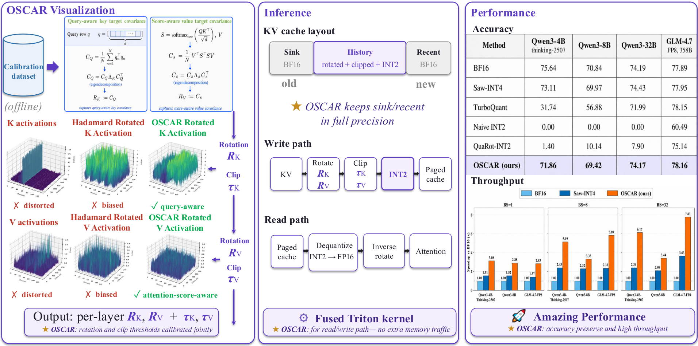
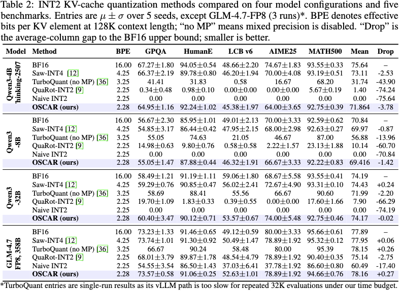

<p align="center">
  
</p>

# OSCAR

### Offline Spectral Covariance-Aware Rotation for 2-bit KV Cache Quantization

<p align="center">
  <a href="https://arxiv.org/pdf/2605.17757"></a>
  <a href="https://oscar-quantize.github.io/"></a>
  <a href="https://huggingface.co/Zhongzhu/OSCAR-RotationZoo"></a>
  <br/>
  <a href="https://huggingface.co/Zhongzhu/OSCAR-LLAMACPP-Qwen3-32B-INT2-KV"></a>
  <a href="https://huggingface.co/Zhongzhu/OSCAR-LLAMACPP-Gemma-4-12B-it-INT2-KV"></a>
  <a href="https://huggingface.co/Zhongzhu/OSCAR-LLAMACPP-Qwen3-4B-Thinking-2507-INT2-KV"></a>
</p>

OSCAR captures Q/K/V activations on a small calibration set, estimates **attention-aware K/V covariance structures** offline, and derives per-layer rotations + clipping thresholds that align KV quantization with the directions attention actually consumes. By storing the bulk of the KV cache in INT2 while retaining only a small BF16 sink and recent window, OSCAR reduces KV-cache memory by approximately **8×** compared with BF16. Under the same memory budget, our **attention kernel** enables up to **7× higher throughput** at large batch sizes, and also accelerates batch-size-1 decoding by up to **3×** by reducing memory-bandwidth overhead.


<p align="center">
  
</p>

OSCAR is built directly into the open-source SGLang framework (main branch), llama.cpp (zhongzhu/llamacpp branch). We also provide a rotation zoo so users can download calibrated rotations directly instead of recomputing them.

## 🔥 Latest News
- **[Upcoming]** OSCAR is testing MiniMax 3, GLM 5.2 and more models in long horizon agentic tasks (1M+ token context). Happy to see OSCAR used in the wild!
- **[2026-06-26]** OSCAR is PRing into **vLLM** too, bringing INT2 KV cache support to another high-throughput serving stack.
- **[2026-06-07]** OSCAR INT2 KV cache now runs **256K Gemma 4 12B under <code style="color : Red">!!16GB!!</code>** and **Qwen3** on the [`zhongzhu/llamacpp` llama.cpp fork](https://github.com/FutureMLS-Lab/OSCAR/tree/zhongzhu/llamacpp) — **~8× smaller KV at near-f16 quality**, with [pre-built `*-rot-kv.gguf` on Hugging Face](https://huggingface.co/Zhongzhu/OSCAR-LLAMACPP-Gemma-4-12B-it-INT2-KV). RUN GEMMA 4 / QWEN3 with LONG CONTEXT on your LOCAL MAC!
  <details>
  <summary> <b>MacBook M5 Max Gemma 4 12B OSCAR INT2 KV Local Run Video</b></summary>
  
  </details>
- **[2026-06-05]** OSCAR now runs its INT2 KV cache through a fused mixed-precision Flash-Attention kernel on Apple Metal in the [`zhongzhu/llamacpp` llama.cpp fork](https://github.com/FutureMLS-Lab/OSCAR/tree/zhongzhu/llamacpp), making long-context decode up to ~15× faster (near-BF16) at ~7× less KV memory. Try to RUN QWEN-3-32B with LONG CONTEXT in your LOCAL MAC!
  <details>
  <summary><b>MacBook M5 Max Qwen3-32B OSCAR INT2 KV Local Run Screenshot</b></summary>
  
  </details>
- **[2026-06-04]** OSCAR now supports **Gemma 4 12B** with **SGLang INT2 KV cache** on the [`zhongzhu/gemma4-12b`](https://github.com/FutureMLS-Lab/OSCAR/tree/zhongzhu/gemma4-12b) branch.
- **[2026-05-31]** OSCAR is now runnable on the zhongzhu/llamacpp branch of **llama.cpp**. Feedback and suggestions are very welcome!
- **[2026-05-23]** OSCAR release the [qwen3.5 4B, 35B-A3B, minimax-m2.7 229B preview results](#main-results). You can use OSCAR for qwen3.5, minimax2.7 beta now! refer to branch zhongzhu/hybrid-model and set SGLANG_LLOYD_MAX=1.
- **[2026-05-18]** Full release: [paper](https://arxiv.org/pdf/2605.17757), code, [website](https://oscar-quantize.github.io/), and [RotationZoo](https://huggingface.co/Zhongzhu/OSCAR-RotationZoo) are all live — runs out of the box on **SGLang**.

## 📖 Table of Contents
- [Main results](#main-results)
- [Layout](#layout)
- [Setup](#setup)
- [Quick start (Qwen3-8B example)](#quick-start-qwen3-8b-example)
- [Model support](#model-support)
- [All configured models](#all-configured-models)
- [How the rotation is fit (spectral covariance)](#how-the-rotation-is-fit-spectral-covariance)
- [Serving with the rotation](#serving-with-the-rotation)
- [Calibration knobs](#calibration-knobs)
- [Troubleshooting](#troubleshooting)
- [Citation](#citation)
- [License & acknowledgements](#license--acknowledgements)

## Main results
<details>
<summary><b>Qwen3.5-4B, Qwen3.5-35B-A3B, MiniMax 2.7 Preview</b> </summary>

Qwen3.5 — BF16 vs OSCAR INT2 KV (2-bit, sink 64 / recent 256), mean ± std over 3 seeds (35B-A3B AIME: 8 seeds, N=30 is high-variance). OSCAR quantizer per model best: 4B uniform, 35B-A3B Lloyd-Max.

**Qwen3.5-4B**
| Benchmark | BF16 | OSCAR | Δ vs BF16 |
|---|:---:|:---:|:---:|
| GPQA-Diamond | 76.9 ± 1.3 | **75.8 ± 1.6** | −1.2 |
| HumanEval | 81.7 ± 1.8 | **83.9 ± 1.0** | +2.2 |
| AIME 2025 | 47.8 ± 3.1 | **46.7 ± 0.0** | −1.1 |
| MATH500 | 89.5 ± 0.6 | **88.0 ± 0.6** | −1.5 |

**Qwen3.5-35B-A3B**
| Benchmark | BF16 | OSCAR | Δ vs BF16 |
|---|:---:|:---:|:---:|
| GPQA-Diamond | 83.3 ± 1.8 | **84.0 ± 1.3** | +0.7 |
| HumanEval | 83.9 ± 0.6 | **86.6 ± 1.8** | +2.6 |
| AIME 2025 † | 66.7 ± 5.3 | **62.1 ± 4.7** | −4.6 |
| MATH500 | 92.8 ± 0.2 | **91.7 ± 0.4** | −1.1 |

<sub>† AIME N=30 is high-variance; measured over 8 seeds. The −4.6 gap is not statistically significant (Welch t=1.72). At 3 seeds it read −6.7, inflated by a favorable BF16 draw.</sub>

MiniMax2.7
| Benchmark | BF16 | OSCAR (LM_RATIO=1.16) | Δ |
|---|---|---|---|
| GPQA-Diamond | 0.7828 | **0.7929** | +1.0 pp |
| HumanEval | 0.8817 | **0.8854** | +0.4 pp |
| AIME 2025 | 0.7667 | **0.7667** | 0.0 pp |
| MATH500 | 0.9379 | **0.9279** | −1.0 pp |

👋 Get started below, or meet the community at [SGLang Events](https://www.sglang.io/events), including meetups, developer meetings, workshops, and office hours.

<details>
<summary><b>MLA models — packed 2-bit latent (GLM-5.2, GLM-5.3, Kimi-K3)</b> </summary>

**What is quantized.** MLA stores one shared latent `c_kv` plus a positional
`k_pe`. OSCAR quantizes **the latent** and leaves **`k_pe` in BF16** — the
opposite way round from how it is easy to read. Per token per layer, at
`kv_lora_rank=512`, `qk_rope_head_dim=64`, group 128:

| buffer | bytes | contents |
|---|---:|---|
| `c_codes` | 128 | the 512-dim latent at **2 bits**, 4 per byte |
| `c_params` | 32 | (scale, zero) fp32 per quantization group |
| `rope_buf` | 128 | `k_pe`, **BF16, never quantized** |
| **total** | **288** | vs BF16's `(512+64)·2 = 1152` → **4.00×** |

`k_pe` staying BF16 is load-bearing: it is the positional half of the MLA key
and 2-bit'ing it destroys the rope term. It is also **44% of the cell**, which
caps this axis — a latent compressed to zero bits would still leave 256 B, i.e.
**4.5× is the ceiling**, and the shipped 4.00× already sits just under it.

**GPQA-Diamond, full 198 questions, `max_tokens=32768`, single seed.** Same
question set and permutations across arms (`Random(0)`), so the rows are paired.

| Model | BF16 | packed 2-bit (4.00×) | Δ |
|---|---:|---:|---:|
| GLM-5.2 | 82.32 | 74.75 | −7.57 pp |
| GLM-5.3 | 82.83 | **77.78** | **−5.05 pp** |

At a **64K** generation budget both models are measured on the same 48-question
subset (`n=48`, `max_tokens=65536`). Kept as its own table because neither the
question count nor the budget matches the one above, and the two are not
comparable — but the rows here are comparable to each other:

| Model | budget | n | BF16 | packed 2-bit (4.00×) | Δ |
|---|---|---:|---:|---:|---:|
| GLM-5.2 | 64K | 48 | 87.50 | 83.33 | −4.17 pp |
| **Kimi-K3** | 64K | 48 | **93.75** | **83.33** | **−10.42 pp** |

The two land on the same 83.33 from very different starting points: K3's BF16 is
6.25 pp higher, and 2 bits takes all of that back and more. Whatever is costing
K3 its 10 points is specific to K3, not to the packed path — GLM-5.2 runs the
identical quantiser for less than half the loss.

GLM-5.3 required **zero model-code changes** — `GlmMoeDsaForCausalLM` is
identical to GLM-5.2's — but rotations do **not** transfer between models and
must be refitted from each model's own `c_kv` dump.

**Ratio / accuracy frontier (GLM-5.2, all end-to-end at n=198).** Every knob
inside 2 bits has been measured; none closes the 4.00× gap, and bit width buys
more accuracy per unit of ratio surrendered than group size does:

| config | ratio | GPQA | vs BF16 |
|---|---:|---:|---:|
| 2-bit g128 (shipped) | 4.00× | 74.75 | −7.57 |
| 2-bit g32 | 3.00× | 77.78 | −4.54 |
| 4-bit g128 | 2.77× | 80.81 | −1.51 |
| BF16 | — | 82.32 | — |

**Where K3's loss actually sits.** Adding stock upstream to the same 48
questions separates the quantiser from this fork:

| arm | KV | GPQA |
|---|---|---:|
| stock upstream sglang | BF16 | 95.83 |
| this fork, no quantiser | BF16 | **93.75** |
| this fork, packed 2-bit | 4.00× | **83.33** |

So the serving path costs **2.1 pp** — one question out of 48, inside the noise
of a single 48-question run — and 2-bit costs **10.4 pp**. Reaching 90 is a
bit-width question, not a bug hunt.

K3 pays more for 2 bits than the GLM models do (−4.2 pp for GLM-5.2 at the same
n=48/64K, −5.1 pp for GLM-5.3 at n=198/32K). It is a KDA/MLA hybrid where only
24 layers carry a latent rotation, so the quantisation error concentrates in
far fewer layers instead of being spread across all of them.

Both figures are single runs at n=48; the standard error on each is about
±5 pp, so the 10.4 pp separation is real but its decimals are not.

That gap prompted an attempt to replace K3's model file with upstream's
wholesale. The attempt is recorded here because it failed instructively: the
ported file served but produced word salad, and the next 38 commits went to
repairing its fallout. Two of those repairs were genuine defects in shared
code and were kept — a use-after-free on the KDA decode metadata, and a
`gate_up_interleaved` that was threaded through FusedMoE and never read.
Neither was K3's problem. K3's problem was the replacement. The model line is
back on the file that scored 70.83.

Worth knowing before trying again: K3's chat format is Python
(`encoding_k3.py`), not a jinja template, and its expert weights are
compressed-tensors `mxfp4-pack-quantized` with only the routed experts
quantized. Its `--reasoning-parser kimi_k3` does not exist in this fork, so
thinking is not split out of `content` and any length comparison against
upstream is not like-for-like.

</details>

<details>
<summary><b>Multi-Modal & LongBench</b> </summary>
Use Rotation and Run Script in zhongzhu/VL branch. Baseline numbers taken from arxiv.org/abs/2605.19660 (Su et al., 2026).

OCRBench comparison
| Method                          | Qwen3-VL-8B | Qwen3-VL-4B |
|---------------------------------|------------:|------------:|
| 16-bit Baseline                 | 858         | 852         |
| QuaRot (INT2)                   | 722         | 773         |
| RotateKV (INT2)                 | 754         | 638         |
| KIVI (INT2)                     | 851         | 813         |
| OTT (INT2)                      | 850         | 831         |
| TurboQuant+ (2.5-bit)           | 847         | 828         |
| **OSCAR (Lloyd-Max)**           | **854**     | **848**     |

Omni-Modal LLMs: MMAU-Pro

| Method (Qwen3-Omni-30B-A3B) | Open-ended | Good Rate | AIF |
|:---------------------------|:----------:|:---------:|:---:|
| 16-bit Baseline | 66.2 | 27.8 | 87.4 |
| KIVI (INT2) | 65.8 | 27.0 | 78.2 |
| OTT (INT2) | 65.8 | 26.9 | 83.9 |
| TurboQuant+ (2.5-bit) | 66.6 | 27.0 | 79.3 |
| **OSCAR** | **67.4** | **33.8** | **89.7** |

LongBench-E comparison

| Method                          | Qwen3-8B    |
|---------------------------------|------------:|
| 16-bit Baseline                 | 49.56       |
| QuaRot (INT2)                   | 40.13       |
| RotateKV (INT2)                 | 42.95       |
| KIVI (INT2)                     | 47.95       |
| OTT (INT2)                      | 48.21       |
| TurboQuant+ (2.5-bit)           | 47.56       |
| **OSCAR**                       | **50.25**   |
</details>

**Setup.** Each cell is the **MEAN across 5 reasoning / coding benchmarks** — **GPQA**, **HumanEval**, **LiveCodeBench v6**, **AIME 25**, **MATH-500**. To control single-seed variance, **every benchmark is evaluated 5 times per (model, method) cell** (3 times for GLM-4.7-FP8) and the per-seed scores are averaged before being averaged across benchmarks. TurboQuant rows are single-run (\*) because its vLLM path is too slow for repeated 32K-context evaluations under our compute budget. All runs use **32K-token max generation length**. **BPE** = effective bits per KV element at 128K context length. Higher is better; the BF16 row is the upper bound.

| Method | BPE | Qwen3-4B&nbsp;Thinking | Qwen3-8B | Qwen3-32B | GLM-4.7-FP8&nbsp;(358B) |
|:---|:---:|:---:|:---:|:---:|:---:|
| BF16 (upper bound) | 16.00 | 75.64 | 70.84 | 74.19 | 77.89 |
| Saw-INT4 | 4.25 | 73.11 | 69.97 | 74.43 | 77.95 |
| TurboQuant K3V3 \* | 3.25 | 31.74 | 56.88 | 71.99 | 78.15 |
| QuaRot-INT2 | 2.25 | 1.40 | 10.14 | 7.90 | 75.14 |
| Naive INT2 | 2.25 | 0.00 | 0.00 | 0.00 | 60.49 |
| **OSCAR (ours)** | **2.28** | **71.86** | **69.42** | **74.17** | **78.16** |
| _Gap of OSCAR vs BF16_ | | _−3.78_ | _−1.42_ | _−0.02_ | _+0.27_ |

<details>
<summary><b>Details for each task </b> </summary>

</details>

<details>
<summary><b>Baseline notes</b> — TurboQuant / QuaRot / Saw-INT4 / Naive INT2 configurations</summary>

For a fair comparison at a comparable bit-budget, **TurboQuant** results use
vLLM's implementation
([docs](https://docs.vllm.ai/en/latest/api/vllm/model_executor/layers/quantization/turboquant/))
modified so that **all layers are quantized** (no mixed precision); the
original TurboQuant keeps the first, last, and selected middle layers in
full precision. We run it in its **K3V3** configuration (3-bit K, 3-bit V)
to land near the OSCAR bit-budget.

**QuaRot-INT2** is the standard 2-bit KV-quant recipe (data-free Hadamard
rotation per layer). **Saw-INT4** is an INT4 reference for context.
**Naive INT2** is per-token symmetric INT2 with no rotation.

\* TurboQuant entries are single-run results because its vLLM path is too
slow for repeated 32K-context evaluations under our compute budget.

</details>

<details>
<summary><b>Comparison with other INT2 KV-cache methods on AIME25</b></summary>

Most prior INT2 KV-cache methods do not provide framework-level support for
efficient long-context generation, so 32K-generation evaluations are extremely
slow and their papers do not report the full benchmark suite above. For this
reason, we compare against the reported AIME25 setting where public numbers are
available.

| Method | BPE | Qwen3-8B | Qwen3-32B |
|:---|:---:|:---:|:---:|
| Original BF16 | 16.00 | 66.00 +/- 7.33 | 72.59 +/- 7.41 |
| KIVI-KV2 | 2.25 | 52.33 +/- 9.00 | 57.41 +/- 9.26 |
| KIVI-KV2* | 2.26 | 57.67 +/- 9.00 | 59.05 +/- 12.38 |
| Kitty | 2.39 | 59.67 +/- 10.33 | 69.26 +/- 9.26 |
| **OSCAR (ours)** | **2.38** | **66.67 +/- 3.33** | **74.00 +/- 5.48** |

OSCAR is the only INT2 method in this comparison that reaches BF16-level AIME25
accuracy at 32K generation while staying near a 2-bit KV-cache budget.

</details>
OSCAR is the only INT2 method that stays within a few pp of BF16 across
every model. QuaRot-INT2 and naive INT2 collapse on reasoning + coding
tasks. Saw-INT4 is a strong INT4 reference, but OSCAR matches or beats it
**at roughly half the storage** (≈2 bits per KV element).

## Layout

```
rotation/
  eval_oscar_gpqa.sh        generic GPQA eval driver
  eval_oscar_lcb.sh         generic LiveCodeBench v6 (128K) eval driver
  compute_kv_rotation.py    eigendecomposition + R·H·P_br composition
  _dump_compat/             sgl_kernel compat shim for dump
  <model>/
    save_qkv_<model>.sh     phase 1 — dump
    compute_rotation.sh     phase 2 — rotation
    eval_gpqa.sh            phase 3 — GPQA eval
    eval_lcb.sh             phase 3 — LCB v6 (128K) eval (where applicable)
    GPQA/
      seq<T>_prompt<N>_group<G>/
        qkv_dumps/          dump output
        rotations/          rotation .pt files
        _eval_gpqa_oscar/   eval results from this rotation
        _eval_lcb_v6_128k/  ...

python/sglang/              sglang (upstream main + the OSCAR low-bit KV cache) — INT2 KV eval
sglang-dump-qkv/            vendored older sglang fork — QKV dump (loaded via shim)
third_party/simple_evals/   git submodule — eval harness (needs git clone --recursive)
```

## Setup

The repository root is upstream SGLang `main` (currently commit `67eab57057`)
with the OSCAR low-bit KV cache added under `python/sglang/`. It is served from
the official `lmsysorg/sglang` nightly image built from that same commit
(`nightly-dev-20261002-67eab570`), with this tree laid over the image's editable
`sglang` install, so there
is no OSCAR-specific environment to assemble: `docker/Dockerfile.oscar` is the
whole recipe. The QKV-dump fork `sglang-dump-qkv/` ships in the repo for
calibration.

### Requirements

- NVIDIA GPUs with the memory the model needs: 1 × 80 GB for the 4B/8B models,
  4 for Qwen3-32B / MiniMax-M2.7 / Gemma-4-12B, 8 for GLM-5.2 / GLM-5.3 /
  MiniMax-M3, 16 across two nodes for Kimi-K3. The verification sweep below
  runs on B200.
- Docker with the NVIDIA container runtime. The base image is the official
  `lmsysorg/sglang` nightly the tree is merged to (CUDA 13.0, torch 2.13,
  transformers 5.17, flashinfer 0.7, sglang-kernel 0.4.8); nothing is
  installed on the host.
- HuggingFace access for the model weights, and the pre-fit rotations from the
  [RotationZoo](https://huggingface.co/Zhongzhu/OSCAR-RotationZoo).

### Clone

```bash
git clone --recursive https://github.com/FutureMLS-Lab/OSCAR.git
cd OSCAR
```

`--recursive` matters: `third_party/simple_evals` is the GPQA scorer, and the
eval driver stops with an explicit error when it is missing instead of scoring
a harness failure as a model result.

### Build the image

The build context holds this tree as `./oscar-src` and the rotations as
`./rotations`; `git archive` leaves submodules out, so the scorer is archived
separately.

```bash
mkdir -p ctx/oscar-src
git archive --format=tar HEAD | tar -x -C ctx/oscar-src
git -C third_party/simple_evals archive --format=tar HEAD \
  | tar -x -C ctx/oscar-src/third_party/simple_evals
hf download Zhongzhu/OSCAR-RotationZoo --local-dir ctx/rotations/zoo
docker build -f docker/Dockerfile.oscar \
  --build-arg IMAGE_TAG="$(git rev-parse --short HEAD)" \
  -t oscar-env:local ctx
```

The build asserts that `import sglang` inside the image resolves to
`/sgl-workspace/sglang/python`, i.e. to this tree, and that the OSCAR modules
parse. GPU kernels are Triton and compile at first use, so the build needs no
GPU.

### Run

```bash
docker run --gpus all --rm -it --shm-size 32g \
  -v "$HOME/.cache/huggingface:/root/.cache/huggingface" -e HF_TOKEN \
  oscar-env:local bash

oscar-selfcheck                                        # tag, commit, torch + device
bash /oscar/src/rotation/run/qwen3-8b.sh               # GPQA under INT2 (default)
KV_MODE=bf16 bash /oscar/src/rotation/run/qwen3-8b.sh  # the paired BF16 control
bash /oscar/src/rotation/verify/all.sh qwen3-8b        # PASS/FAIL smoke, radix + graph on
```

To serve a model directly rather than through a recipe, see
[Serving with the rotation](#serving-with-the-rotation).

### Without Docker

Any environment that runs upstream SGLang at this commit runs OSCAR:
`pip install -e python` replaces the `sglang` package with this tree. Match the
sgl-kernel and flashinfer builds the official image pins for this version;
OSCAR adds no compiled extension of its own.

## Quick start (Qwen3-8B example)

End-to-end on a single H100, ~20 minutes total.

```bash
cd OSCAR

# Phase 1 — dump Q/K/V (TP=1, default DUMP_KVCACHE_TOKENS=30000)
bash rotation/qwen3-8B/save_qkv_8b.sh
# → writes rotation/qwen3-8B/GPQA/seq30000_prompt<N>_group128/qkv_dumps/

# Phase 2 — fit the calibrated rotation
bash rotation/qwen3-8B/compute_rotation.sh
# → writes rotation/qwen3-8B/GPQA/seq30000_prompt<N>_group128/rotations/{k,v}_rotation_qqt_r_h_pbr.pt

# Phase 3 — GPQA eval against the rotation we just produced
ROT_DIR=rotation/qwen3-8B/GPQA/seq30000_prompt<N>_group128/rotations \
  bash rotation/qwen3-8B/eval_gpqa.sh
# → writes results to rotation/qwen3-8B/GPQA/seq30000_prompt<N>_group128/_eval_gpqa_oscar/
```

Pick the actual `seq...prompt..._group...` tag printed by phase 1, or:

```bash
ROT_DIR=$(ls -1d rotation/qwen3-8B/GPQA/seq*_prompt*_group*/rotations | tail -1) \
  bash rotation/qwen3-8B/eval_gpqa.sh
```

## The image

**One image serves every model**; there is no per-model tag to pick. Model
weights are deliberately not included: they are ~2 TB and re-download at tens
of GB/min, whereas the environment is the part that is slow and fragile to
rebuild.

| path in the image | contents |
|---|---|
| `/sgl-workspace/sglang` (also `/oscar/src`) | this tree; the image's editable `sglang` install resolves here |
| `/oscar/rotations/zoo/<model>/` | per-head K/V rotations from the RotationZoo |
| `/oscar/rotations/glm52-rotations/`, `glm53-rotations/`, `k3_latent_rot/` | per-layer MLA latent rotation sets for GLM-5.2, GLM-5.3 and Kimi-K3 |
| `/oscar/IMAGE_TAG`, `/oscar/BUILT_FROM` | the tag, and the branch + commit the tree came from, so a number from a cluster can be matched to the tree that produced it |
| `/usr/local/bin/oscar-selfcheck` | prints tag and commit, torch and the CUDA device, and `OSCAR_SELFCHECK_OK` once `import sglang` resolves to this tree |

Run `oscar-selfcheck` on a GPU node before trusting a long job to an image: it
is the one check that exercises the driver, which a build host without a GPU
cannot.

### One command per model

Each `rotation/run/<model>.sh` is a thin wrapper over `eval_oscar_gpqa.sh`
carrying only that model's recipe — the checkpoint id, the rotation set, the
sink/recent window, the parallelism. Nothing re-implements the launch path, and
the model id is baked in, so a GPQA run is one command with no arguments:

```bash
bash /oscar/src/rotation/run/qwen3-8b.sh                 # INT2 (default)
KV_MODE=bf16 bash /oscar/src/rotation/run/qwen3-8b.sh    # the paired control
bash /oscar/src/rotation/verify/all.sh                   # the PASS/FAIL sweep
```

The recipes differ in ways that matter (per-head rotation for Qwen3-30B-A3B,
Lloyd-Max codebook, group size 256 for Qwen3.5, packed 2-bit latent for the MLA
models, the Mamba radix-cache strategy for the hybrids); `rotation/examples/`
tabulates them.

## Model support

Every model below runs from this tree with `--kv-cache-dtype int2` and the
per-model recipe in `rotation/run/<model>.sh`; there are no feature branches.
Per-head K/V models use the mixed INT2 pool with BF16 sink/recent windows;
MLA models (GLM-5.2, GLM-5.3, Kimi-K3) store the packed 2-bit latent
(288 B/token/layer, 4.00× against BF16) and are served through upstream's own
sparse attention (DSA for GLM, `trtllm_mla` for Kimi-K3); MiniMax-M3 runs its
native MSA sparse attention with the INT2 rows staged into BF16 per layer.

### Garbling sweep (one image, radix cache and CUDA graphs on)

`rotation/verify/all.sh` serves every supported model from a single image with
radix cache and CUDA graphs **on**, sends the probe through the chat template,
and judges the output on four shape checks rather than a letter ratio (a
letter-ratio judge passed four error strings). `PASS` means *did not collapse*,
not *answered correctly*: a fluent, off-task answer passes. Verdicts append to
a file on the volume after each model, so a pre-empted pod costs time and not
results.

The probe goes through the chat template on purpose. Gemma-4-12B-it on a raw
`/generate` prompt echoes the prompt tail (" Answer in. Answer in.") in HF
transformers exactly as in sglang, because its tokenizer under transformers 5.12
prepends no `<bos>` to raw text; the template carries the token and the model
answers. A probe that bypasses the model's real input path measures the probe.

| model | smoke on this tree (base `67eab57057`) |
|---|---|
| Qwen3-4B-Thinking-2507, Qwen3-8B, Qwen3-32B, Qwen3-30B-A3B | PASS |
| Qwen3.5-4B, Qwen3.5-35B-A3B (hybrid GatedDeltaNet) | PASS |
| Gemma-4-12B-it (hybrid SWA, dual head_dim) | PASS |
| MiniMax-M2.7 | PASS |
| GLM-5.2-FP8, GLM-5.3 (DSA + packed 2-bit latent) | PASS (92 / 90 graph shapes captured, prefix hits logged) |
| MiniMax-M3 (MSA + INT2 staging) | PASS (91 graph shapes, prefix hits logged) |
| Kimi-K3 (TP 8 × PP 2, packed 2-bit latent) | pending (two-node job; the probe runs inside its GPQA job, waiting for two whole nodes) |

**Kimi-K3 is verified separately, not by this sweep.** It needs 16 GPUs across
two nodes (tp 8 × pp 2, 1.4 TB of MXFP4 weights) and the sweep is one pod with
eight, so its row could only ever report `FAIL(no-serve)` — which reads as a
broken model and means a harness that cannot host it. K3 runs from
`rotation/run/kimi-k3.sh` as a two-node job.

## All configured models

Calibration-pipeline folders included on this branch (`rotation/<model>/`):

| Folder | HF model | TP (dump) | TP (eval) | Notes |
|---|---|---|---|---|
| `rotation/qwen3-4B-thinking-2507/` | `Qwen/Qwen3-4B-Thinking-2507` | 1 | 1 | thinking model |
| `rotation/qwen3-8B/` | `Qwen/Qwen3-8B` | 1 | 1 | |
| `rotation/qwen3-32B/` | `Qwen/Qwen3-32B` | 2-4 | 4 | |
| `rotation/GLM-4.7/` | `zai-org/GLM-4.7-FP8` | 8 | 8 | FP8 weights, 92 layers |
| `rotation/gemma-4-12B-it/` | `google/gemma-4-12B-it` | 1 | 1 | `gemma4_unified` hybrid-SWA, dual head_dim (sliding 8×256 / full 1×512), all INT2; optional vision via `--enable-multimodal` |

### Per-model GPQA: BF16 vs OSCAR INT2 (this tree)

The table is populated only from runs on **this tree at its current upstream
base** (`67eab57057`, nightly image `nightly-dev-20261002-67eab570`); numbers
from earlier bases are not carried over. Both arms of a row share one launch
path (`rotation/run/<model>.sh`) and differ only in `KV_MODE`; GPQA-Diamond is
single-seed, all 198 questions, at a 64K generation budget with radix cache
and CUDA graphs on. The sweep starts once every model's smoke passes on this
base.

**The INT2 arm runs the model's own attention.** GLM-5.2/5.3 run upstream's
DSA sparse attention (flashmla_sparse prefill, trtllm sparse decode) with the
packed 2-bit latent staged per layer; MiniMax-M3 runs upstream's MSA sparse
top-k (indexer on the real token table, INT2 rows dequantized per layer for the
same sparse kernels); Kimi-K3 runs MLA + KDA across two nodes; the rest are
dense GQA. The BF16 control uses the same backend in every row.

| Model | INT2 attention path | n / budget | GPQA (BF16) | GPQA (OSCAR INT2) | Δ |
|---|---|---|---:|---:|---:|
| `Qwen/Qwen3-4B-Thinking-2507` | dense GQA | 198 / 64K | 63.6 | 64.6 | +1.0 |
| `Qwen/Qwen3-8B` | dense GQA | 198 / 64K | pending | pending | |
| `Qwen/Qwen3-32B` | dense GQA | 198 / 64K | pending | pending | |
| `Qwen/Qwen3-30B-A3B` | dense GQA, per-head rotation | 198 / 64K | 61.1 | 55.6 | −5.6 (INT2 answers run longer: median 49K vs 32K chars, 12 of 198 hit the budget without a final answer vs 0; same shape as on the previous base) |
| `Qwen/Qwen3.5-4B` | hybrid GDN + GQA | 198 / 64K | 79.3 | 75.3 | −4.0 |
| `Qwen/Qwen3.5-35B-A3B` | hybrid GDN + GQA | 198 / 64K | 86.9, 81.8 [^two] | 79.3, 83.8 [^two] | −2.8 (means) |
| `google/gemma-4-12B-it` | hybrid SWA, two geometries | 198 / 64K | 62.1, 63.1 [^two] | 69.7, 64.1 [^two] | +4.3 (means) |
| `MiniMaxAI/MiniMax-M2.7` | dense GQA | 198 / 64K | pending | pending | |
| `MiniMaxAI/MiniMax-M3` | MSA sparse top-k (upstream backend) | 198 / 64K | pending | pending | |
| `zai-org/GLM-5.2-FP8` | DSA sparse (upstream backend), packed latent 4.00× | 198 / 64K | pending | pending | |
| `zai-org/GLM-5.3` | DSA sparse (upstream backend), packed latent 4.00× | 198 / 64K | pending | pending | |
| `zai-org/GLM-4.7-FP8` | dense GQA | 198 / 64K | pending | pending | |
| `moonshotai/Kimi-K3` | MLA latent + KDA, packed latent 4.00×, TP 8 × PP 2 | 198 / 64K | pending | pending | |

[^two]: Two independent draws per arm, listed first draw then second. A
    single-seed pair whose gap was out of line with the other rows was sampled
    again on the same tree rather than reported as is. Qwen3.5-35B-A3B: the
    first pair read INT2 79.3 vs BF16 86.9; the second draws are 83.8 and 81.8,
    the two BF16 draws are 5.1 points apart by per-question pairing (McNemar
    p = 0.03), and an INT2 run with the prefix cache disabled scores 84.8.
    Gemma-4-12B-it is the mirror image: the first pair read INT2 69.7 vs BF16
    62.1 (p = 0.02); the second draws are 64.1 and 63.1, and every second-draw
    pairing is inside noise (p ≥ 0.6). Its answers are short (median ~2.7K
    characters), so the spread is temperature sampling, not the budget.

### 64K decode on B200 (this tree)

Batch size 1, a 65,536-token prompt followed by 512 generated tokens, median
of three repeats; measured after the GPQA sweep on the same base. The BF16
column is the same model on the triton backend (what OSCAR's INT2 kernels
replace); the FlashInfer column is the fastest BF16 baseline that serves the
model (for GLM that is upstream's DSA path, for Gemma-4 `trtllm_mha`, the only
FlashInfer-family backend its model file accepts). A GPU keep-alive that the
cluster's idle-pod reaper requires during weight loads is paused while the
server answers `/v1/models`, so no foreign kernel runs during a measurement.

| Model | INT2 ms/tok | BF16 triton ms/tok | BF16 FlashInfer ms/tok | INT2 vs FlashInfer |
|---|---:|---:|---:|---:|
| Qwen3-4B-Thinking-2507 | 12.19 | 33.74 | 4.40 | 2.77× slower |
| Qwen3-8B | 13.76 | 35.01 | 5.41 | 2.54× slower |
| Qwen3-32B | 22.04 | 61.52 | 9.30 | 2.37× slower |
| Qwen3-30B-A3B | 14.04 | 42.67 | 3.64 | 3.86× slower |
| Qwen3.5-4B | 5.78 | 11.17 | 2.90 | 1.99× slower |
| Qwen3.5-35B-A3B | 6.63 | 13.89 | 2.61 | 2.54× slower |
| Gemma-4-12B-it | 19.98 | 18.45 | 6.66 (trtllm_mha) | 3.00× slower |
| MiniMax-M2.7 | 25.80 | 69.01 | 8.20 | 3.15× slower |
| GLM-4.7-FP8 | 26.68 | 74.49 | 9.73 | 2.74× slower |
| GLM-5.2-FP8 | 14.32 | 10.52 (DSA, same backend both arms) | 10.52 (DSA) | 1.36× slower |
| GLM-5.3 | 14.33 | 10.52 (DSA, same backend both arms) | 10.52 (DSA) | 1.36× slower |
| MiniMax-M3 | 13.75 | 12.04 (MSA sparse, same backend both arms) | 9.01 | 1.53× slower |
| Kimi-K3 | pending | pending | pending (trtllm_mla) | |

> Every model's serving recipe (rotation set, windows, codebook, parallelism) is `rotation/run/<model>.sh` on this tree; pre-fit rotations for all of them are on the [RotationZoo](https://huggingface.co/Zhongzhu/OSCAR-RotationZoo).

## How the rotation is fit (spectral covariance)

For each transformer layer, given calibration `(Q, K, V)` activations, OSCAR estimates two attention-aware **covariance** matrices and uses their eigenspectra to derive rotations:

- **K covariance** (`qqt`) — average attention-query covariance seen by K:
  `Σ_K = (1/H_kv) · Σ_h Q_h^T Q_h / n_tokens` (GQA-aware: query heads grouped under the matching KV head)
- **V covariance** (`sst`) — score-weighted V-side covariance:
  `Σ_V = (1/H_kv) · Σ_h V_h^T diag(w_h) V_h / n_tokens` where `w_h[t] = K_h[t] · (Q^T Q) · K_h[t]^T` is the per-token attention-score weight derived from K and the Q covariance
- `torch.linalg.eigh(Σ)` → orthogonal eigenvectors `R` plus the eigenvalues (used for ordering, not for scaling)
- Composition `r_h_pbr`: `R_loaded = R · H_d · P_br`
  - `H_d` — head-dim Hadamard
  - `P_br` — bit-reversal permutation, sorted by eigenvalue magnitude; this interleaves high-variance directions evenly across quant groups so no single group concentrates outliers

Saved as fp32 per-layer `(head_dim, head_dim)` orthogonal matrices in
`<calib_dir>/rotations/{k,v}_rotation_qqt_r_h_pbr.pt`.

## Serving with the rotation

The eval driver `eval_oscar_gpqa.sh` and `eval_oscar_lcb.sh` set everything for you. The underlying sglang server flags are:

```bash
SGLANG_ENABLE_MIXED_KV_WINDOWS=1 \
SGLANG_OSCAR_K_ROTATION_PATH=.../k_rotation_qqt_r_h_pbr.pt \
SGLANG_OSCAR_V_ROTATION_PATH=.../v_rotation_sst_r_h_pbr.pt \
SGLANG_OSCAR_K_CLIP_RATIO=0.96 \
SGLANG_OSCAR_V_CLIP_RATIO=0.92 \
SGLANG_OSCAR_ABSORB_V_ROTATION=1 \
SGLANG_MIXED_KV_PREFIX_TOKENS=64 \
SGLANG_MIXED_KV_RECENT_TOKENS=256 \
SGLANG_MIXED_KV_HP_MAX_SPLITS=8 \
SGLANG_MIXED_KV_HP_DTYPE=bfloat16 \
SGLANG_MIXED_KV_SCALE_DTYPE=float32 \
python -m sglang.launch_server \
  --model-path <model> \
  --tensor-parallel-size <tp> \
  --kv-cache-dtype int2 \
  --kv-cache-quant-group-size 128 \
  --prefill-attention-backend fa3 \
  --decode-attention-backend triton \
  --trust-remote-code
```

Sink (`PREFIX_TOKENS`) and recent window (`RECENT_TOKENS`) stay in BF16; the rest of the cache is INT2-quantized into 128-element groups along head-dim.

### Skip calibration — use a pre-fit rotation from RotationZoo

To serve without running phases 1–2, download a calibrated rotation from the [RotationZoo](https://huggingface.co/Zhongzhu/OSCAR-RotationZoo) and point the env vars at it:

```bash
huggingface-cli download Zhongzhu/OSCAR-RotationZoo --include "Qwen3-8B/*" --local-dir rotzoo
ROT=$(ls -1d rotzoo/Qwen3-8B/seq*_prompt*_group128 | tail -1)
export SGLANG_OSCAR_K_ROTATION_PATH=$ROT/k_rotation_qqt_r_h_pbr.pt
export SGLANG_OSCAR_V_ROTATION_PATH=$ROT/v_rotation_sst_r_h_pbr.pt
```

## Calibration knobs

Override per `bash rotation/<model>/save_qkv_<model>.sh ENV=val`:

| Env | Default | Effect |
|---|---|---|
| `DUMP_KVCACHE_TOKENS` | 30000 | Total token budget for calibration |
| `GROUP_SIZE` | 128 | KV quant group size, encoded in output dir name |
| `DATASET` | GPQA | Calibration dataset name |
| `MODEL` | per-model HF id | HuggingFace model id |
| `TP_SIZE` | per-model | Tensor parallel size for dump |
| `GPU` | per-model | CUDA_VISIBLE_DEVICES |
| `HF_HOME` | `$HOME/.cache/huggingface` | HF cache (override to a shared cache if you have one) |

## Troubleshooting

- **Garbled / mixed-language output in long-context agent sessions.** Update to the latest `main`. Older checkouts (before the mixed-KV slot-accounting fix) could free KV slots still referenced by other in-flight requests under concurrency, corrupting reads.
- **`--kv-cache-dtype int2` only supports full-attention models.** MLA models (GLM-5.1 / DeepSeek-style) and hybrid linear-attention models (Qwen3.5 GatedDeltaNet) are not supported on `main` yet — see [Model support](#model-support).
- **Hybrid models (Qwen3.5, Kimi-K3).** Their prefix cache needs `--mamba-radix-cache-strategy extra_buffer` (the recipes set it); without it the Mamba radix cache asserts `page_size == 1`, which surfaces asynchronously as an illegal memory access.
- **Running locally on a Mac.** Use the `zhongzhu/llamacpp` branch or the pre-built `*-rot-kv.gguf` files on Hugging Face.

## Citation

```bibtex
@misc{zhou2026oscarofflinespectralcovarianceaware,
      title={OSCAR: Offline Spectral Covariance-Aware Rotation for 2-bit KV Cache Quantization},
      author={Zhongzhu Zhou and Donglin Zhuang and Jisen Li and Ziyan Chen and Shuaiwen Leon Song and Ben Athiwaratkun and Xiaoxia Wu},
      year={2026},
      eprint={2605.17757},
      archivePrefix={arXiv},
      primaryClass={cs.LG},
      url={https://arxiv.org/abs/2605.17757},
}
```

## License & acknowledgements

- Released under the MIT License.
- Built on top of [sglang](https://github.com/sgl-project/sglang).
